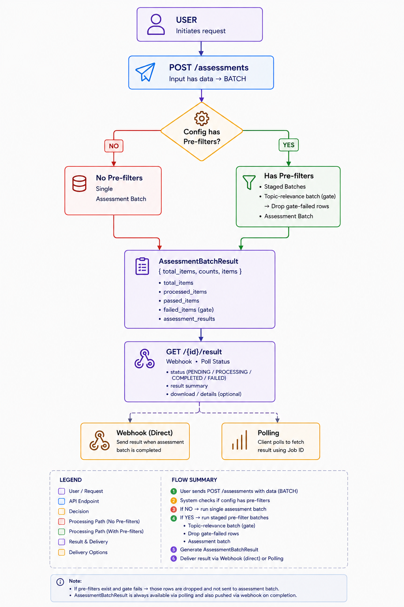

# Running an Assessment

Once you have a saved [config](configs.md), you run an assessment by submitting your items to `POST /assessments`. The request returns right away with an `assessment_id`; the finished results are delivered to your **webhook** when grading completes.

> Looking for exact field types, status values, and error codes? See the **[API contract](api-contract.md)**.

---

## 1. Submit your items

`POST /assessments`

```json
{
  "config": { "id": "a9015dbf-…", "version": 1 },
  "input": {
    "query": "Grade the answer sheet {answer_sheet} for submission {submission_id}.",
    "data": [
      { "submission_id": "s1", "answer_sheet": "https://cdn.example.com/s1.jpg" },
      { "submission_id": "s2", "answer_sheet": "https://cdn.example.com/s2.jpg" }
    ]
  },
  "callback_url": "https://your-app.example.com/webhooks/assessment",
  "request_metadata": { "batch": "class7-term1" }
}
```

| Field | Required | What it is |
|---|---|---|
| `config` | ✅ | which saved config version to run (`id` + `version`) |
| `input.query` | ✅ | a template; `{column}` placeholders are filled per row |
| `input.data` | ✅ | your rows — a list of `{ column: value }` objects |
| `callback_url` | ✅ | the webhook the result is POSTed to (must be **HTTPS**) |
| `request_metadata` | optional | any object; echoed back unchanged in the result |

Sending a `data` list makes this a **BATCH** assessment automatically.

### Your rows must match the config's `input_schema`

Every row is checked against the config. A row that doesn't match is rejected with **`422`** (the failing row index is named):

- **missing** a declared column,
- has an **extra** column not in the schema, or
- an `image` / `pdf` column whose value isn't a URL.

---

## 2. The acknowledgement

You get back an immediate ack — it confirms the work is queued, it does **not** contain results:

```json
{
  "success": true,
  "data": {
    "assessment_id": "8a2a7bc1-…",
    "status": "PROCESSING",
    "message": "Your assessment is being processed",
    "inserted_at": "2026-08-12T10:15:30Z",
    "updated_at": "2026-08-12T10:15:30Z"
  },
  "error": null,
  "metadata": null
}
```

Keep the `assessment_id` to match up the webhook later.

---

## 3. What happens next

Kaapi grades in the background:

1. If your config has pre-filters, they run first (e.g. the topic-relevance **gate** drops off-topic rows).
2. The remaining rows are graded by the assessment call.
3. When everything finishes, the result is **POSTed to your `callback_url`**.

There is no polling or status endpoint today — **delivery is webhook-only**.

---

## 4. The webhook result

Kaapi POSTs this to your `callback_url` when the assessment finishes:

```json
{
  "assessment_id": "8a2a7bc1-…",
  "status": "COMPLETED",
  "data": {
    "total_items": 2,
    "counts": { "assessed": 1, "filtered": 1, "errors": 0 },
    "items": [
      {
        "output": {
          "assessment": { "score": 20, "feedback": "…" },
          "pre_filter": { "topic_relevance": { "verdict": true, "reasoning": "…" } }
        },
        "error": null
      },
      {
        "output": {
          "assessment": null,
          "pre_filter": { "topic_relevance": { "verdict": false, "reasoning": "off-topic" } }
        },
        "error": null
      }
    ]
  },
  "request_metadata": { "batch": "class7-term1" }
}
```

| Field | What it is |
|---|---|
| `status` | terminal: `COMPLETED`, `COMPLETED_WITH_ERRORS`, or `FAILED` |
| `data.counts` | `assessed` (graded), `filtered` (gated out), `errors` |
| `data.items[]` | one entry per input row, in order |
| `items[].output.assessment` | the filled result object (your `json_output_schema`), or `null` if the row was gated out or failed |
| `items[].output.pre_filter` | the per-item pre-filter verdicts, each `{ verdict, reasoning }` or `null` |
| `items[].error` | a per-row error, or `null` |
| `request_metadata` | the object you sent, echoed back |

Gate-failed rows still appear (with `assessment: null`) so you can see *why* they weren't graded.

---

## RESPONSE method 🚧 (WIP)

A single-item, low-latency variant is planned: send one `query` (instead of a `data` list) and get one result back. **It is not built yet** — a RESPONSE-shaped request returns `501` today.



> Planned design. Not available yet.
