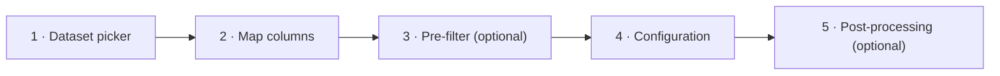
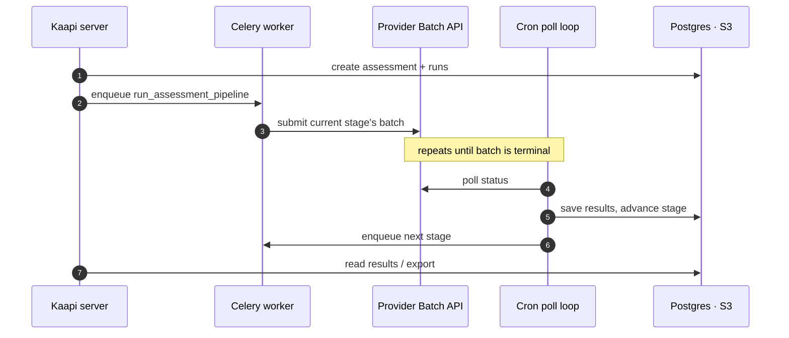
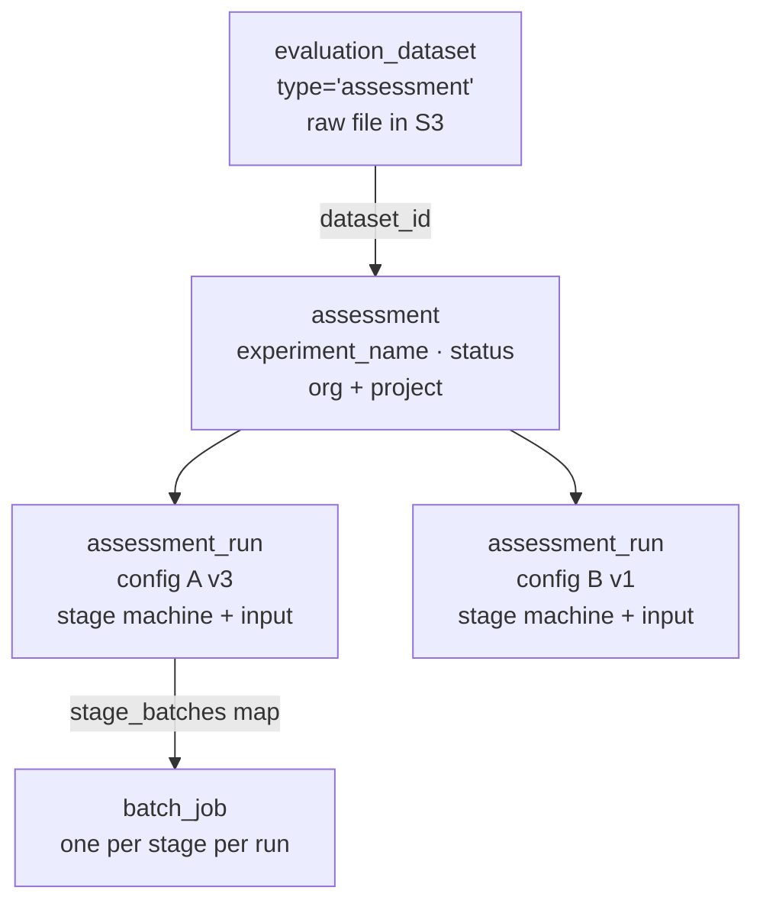
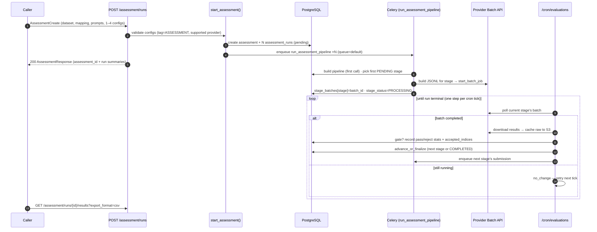
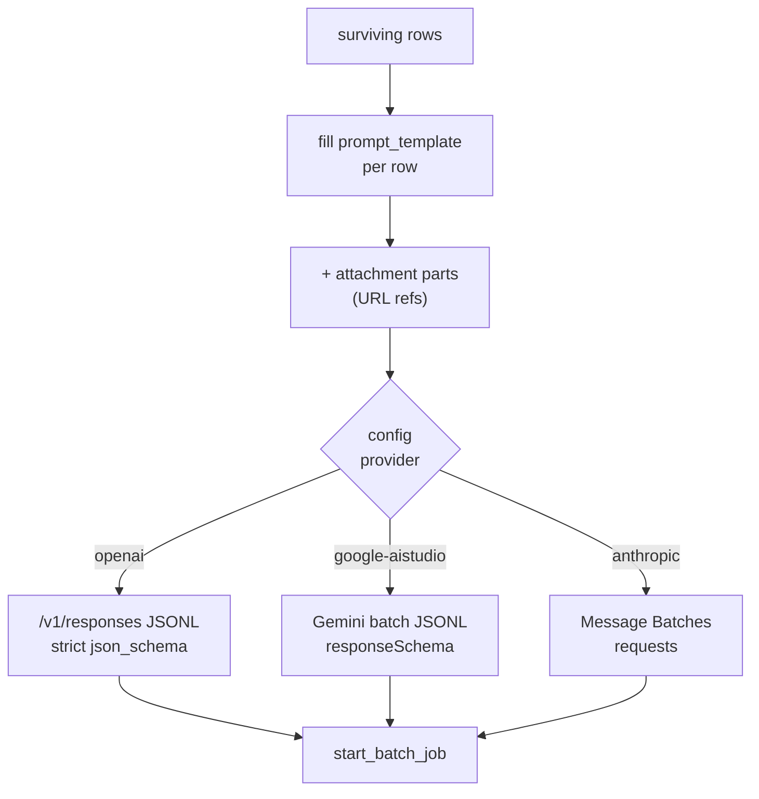
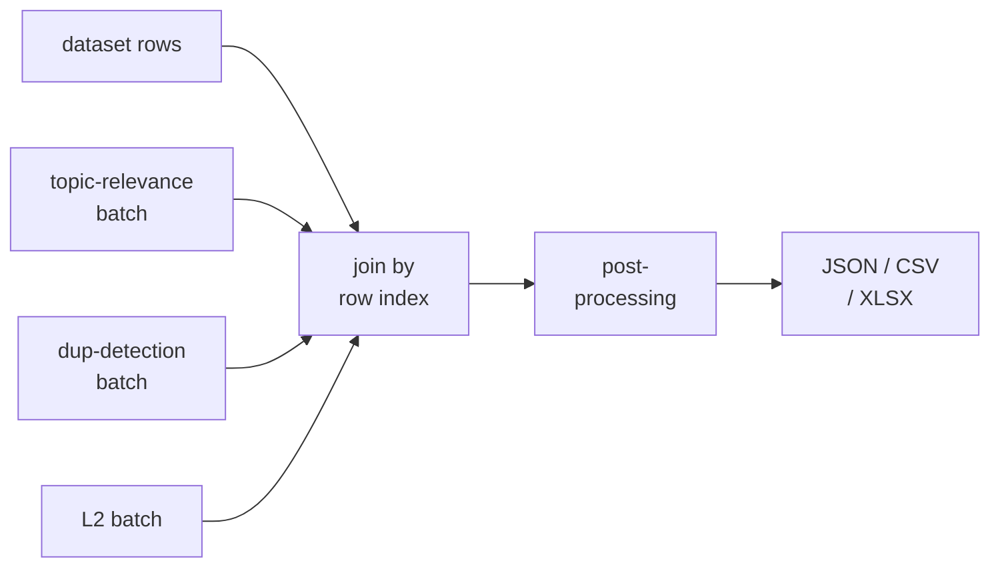
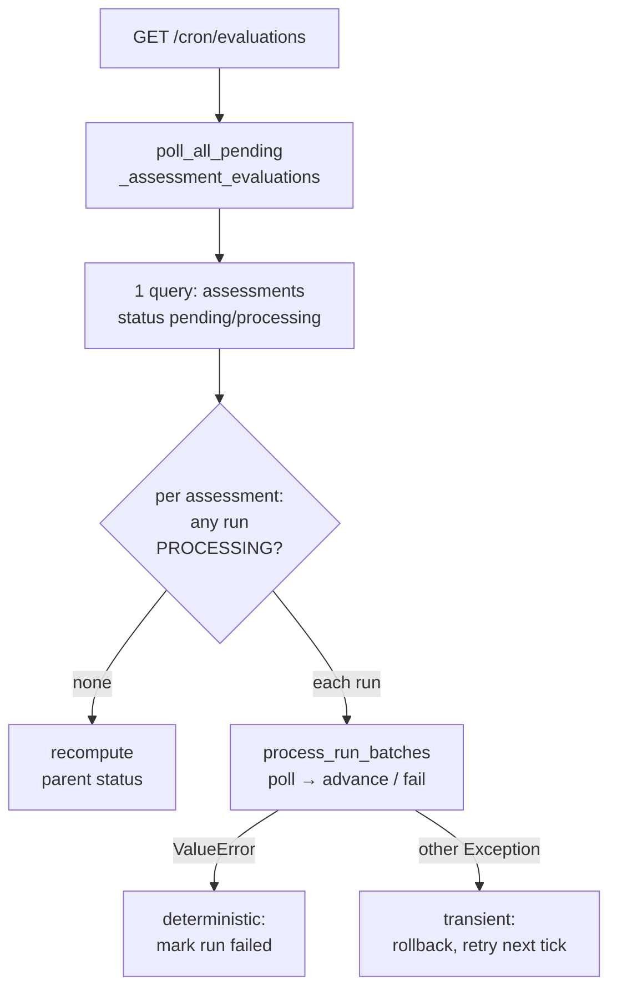
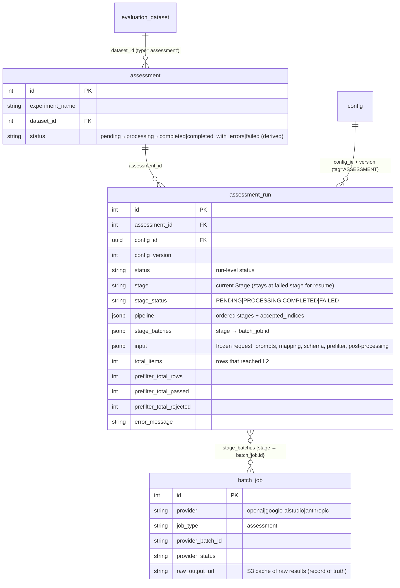

# Kaapi AI Assessments — Architecture Overview

## Purpose

The **AI Assessments** module runs **rubric-based LLM grading** of submissions
at scale. A *submission* is one row of a dataset: text fields (e.g. a problem
statement and a proposed solution) plus attachment URLs (photos, PDFs). For
every row, an LLM applies a caller-supplied rubric prompt and returns a
**structured result** — per-metric scores with reasoning and a feedback note,
in a caller-defined JSON schema.

The module is built for **side-by-side experimentation**: one dataset is run
through several prompt/model configurations at once, and the results are
compared per configuration to decide which setup grades best.

Today every row is graded via a **provider Batch API** (OpenAI / Gemini /
Anthropic) — cheaper, but results land only after the whole batch completes,
with no fast feedback loop for small datasets or quick rubric iteration. A
per-row assessment call — the same way `/llm/call` runs a single call with no
batch — will be introduced to close this gap.

The user flow:

1. **Dataset picker** — pick an uploaded CSV/XLSX (or upload a new one).
2. **Map columns** — which columns are text input, which are image/PDF
   attachments, which (optionally) hold ground truth.
3. **Pre-filter** *(optional)* — topic-relevance gate and/or duplicate
   detection, run before grading.
4. **Configuration** — user prompt (the rubric) + system prompt, up to **4 LLM
   configurations** to compare side by side, and the structured output shape
   (JSON schema) every config must return.
5. **Post-processing** *(optional)* — computed columns, filter, sort, applied
   to results at export.

Kaapi then: creates one **assessment** (the experiment) with one **child run**
per config, submits each run through the staged pipeline above (every stage is
currently a provider batch job), polls for completion via the shared
evaluations cron, and serves per-run results (JSON/CSV/XLSX export) with the
post-processing layer applied at read time.

Key architectural properties:

- **Two-level model.** `assessment` (parent = one experiment on one dataset)
  groups N `assessment_run` children (one per config). "Compare 3 models on the
  same dataset" = one assessment with 3 runs. Parent status is derived from
  child statuses; each run progresses independently — if one config's run
  fails at a stage, the other configs' runs are unaffected.
- **Retry at every level.** A failed run can be resumed **from the exact stage
  it failed at** (upstream stage batches are reused, not re-run) — no need to
  redo the whole config just because one stage broke. On top of that, retry
  also exists at the **run level** (rebuild one config's run from scratch) and
  the **assessment level** (rebuild the whole experiment, all configs, from
  scratch). See §6.
- **A staged pipeline, one batch per stage.** Each run walks an ordered stage
  list persisted on the run (`pipeline` JSONB):
  `PRE_FILTER_TOPIC_RELEVANCE` (go/no-go gate, optional) →
  `PRE_FILTER_DUPLICATE_DETECTION` (annotative, optional) →
  `L2_ASSESSMENT` (mandatory core grading). Every stage is submitted as its own
  provider batch; rows rejected by a gate never reach (or cost anything at)
  later stages.
- **Celery submits, cron advances.** A Celery task submits the current stage's
  batch and exits. The shared `GET /cron/evaluations` poll loop detects batch
  completion, records stage results, advances the run to the next stage, and
  re-enqueues the Celery task — a submit → poll → advance loop until the run
  completes.
- **Multi-provider batch.** Unlike text evals (OpenAI-only), L2 assessment
  batches run on **OpenAI, Google AI Studio (Gemini), or Anthropic** — the
  provider comes from the run's config. This is the first consumer of
  `AnthropicBatchProvider`.
- **No per-item results table.** The record of truth for row-level outputs is
  the **batch result file** (cached in S3 via `batch_job.raw_output_url`);
  exports re-parse it on read and join it with the dataset rows and prefilter
  annotations. Only aggregates (counts, stage, status) live on the run row.
- **Config-driven & versioned.** A run pins `config_id + config_version` from
  the same versioned config store as `/llm/call`, restricted to configs tagged
  `ASSESSMENT`.

---

## 1. The high-level view

**The user flow** (matches the console UI):



| Step | What happens |
|---|---|
| 1 · Dataset picker | pick an uploaded CSV/XLSX, or upload a new one |
| 2 · Map columns | which columns are text input, image/PDF attachments, (optionally) ground truth |
| 3 · Pre-filter *(optional)* | topic-relevance gate and/or duplicate detection, run before grading |
| 4 · Configuration | user prompt (rubric) + system prompt, up to 4 LLM configs to compare, structured output schema |
| 5 · Post-processing *(optional)* | computed columns, filter, sort — applied to results at export |

Submitting this form creates one `assessment` with one `assessment_run` per
config, and Kaapi takes over from there: each run is pushed through the staged
batch pipeline (prefilter gate → dup check → L2 assessment), polled to
completion, and its results are readable — with post-processing applied — as
soon as it finishes. Retry is available at the stage, run, and assessment
level (§6).

**Who runs what** — the server only registers work and reads results; all slow
work happens in the provider batch backends, driven forward by a Celery worker
and the cron poll loop:



The last three steps repeat **once per stage, per run** until every stage is
done: the Celery worker submits one batch, the cron detects its completion,
records the results, advances the run to the next stage, and re-enqueues the
worker. The server never waits on a model — it only creates the run and later
reads whatever the cron has written.

---

## 2. Component map

```
backend/app/
├── api/routes/
│   ├── cron.py                          → GET /cron/evaluations also polls assessments
│   └── assessment/                      mounted at /assessment
│       ├── __init__.py                  mounts datasets + runs + assessments routers
│       ├── datasets.py                  dataset upload / list / get(+preview) / delete
│       ├── runs.py                      ★ POST /runs (create) · retry · resume · list ·
│       │                                  get · results export · post-processing PATCH
│       └── assessments.py               parent: list · get · retry · combined results export
│
├── services/assessment/
│   ├── service.py                       ★ start_assessment · retry_* · resume_assessment_run
│   ├── tasks.py                         ★ execute_assessment_pipeline (Celery body):
│   │                                      orchestrate → submit current stage's batch
│   ├── stages.py                        stage registry · build_pipeline · GATE_STAGES ·
│   │                                      submit_prefilter_batch · advance_or_finalize
│   ├── dataset.py                       upload_dataset (CSV/XLSX → S3, row count, preview)
│   ├── mappers.py                       Kaapi params → openai/google/anthropic batch params
│   │                                      (+ strict-JSON-schema normalisation per provider)
│   ├── validators.py                    upload validation
│   ├── prefilter/
│   │   ├── constants.py                 prefilter provider/model + dup-corpus store (static)
│   │   ├── pipeline.py                  resolve_prefilter_settings (which stages enabled)
│   │   ├── request_builder.py           provider-shaped batch request line builder
│   │   ├── topic_relevance.py           go/no-go gate: build requests + parse verdicts
│   │   └── duplicate_detection.py       file_search-grounded dup check: build + parse
│   └── utils/
│       ├── attachments.py               URL-only attachment parts (Drive URL normalisation)
│       ├── parsing.py                   stored-results parsing + usage totals
│       ├── export.py                    join dataset rows + prefilter + L2 → export rows
│       └── post_processing.py           computed columns (@col formulas) · filter · sort
│
├── crud/assessment/
│   ├── core.py                          assessment/run CRUD · compute_run_counts ·
│   │                                      recompute_assessment_status (derive parent status)
│   ├── batch.py                         ★ dataset row loading · per-provider JSONL builders ·
│   │                                      submit_assessment_batch (the L2 submit)
│   ├── processing.py                    ★ process_run_batches (poll stage → advance) ·
│   │                                      parse_assessment_output (per-provider result parse)
│   ├── cron.py                          poll_all_pending_assessment_evaluations (entrypoint)
│   └── dataset.py                       dataset CRUD (type='assessment')
│
├── core/batch/                          shared provider-agnostic batch infra (see evals doc §8)
│   ├── openai.py · gemini.py · anthropic.py   the three batch providers used here
│   └── operations.py                    start_batch_job · process_completed_batch (S3 cache)
│
├── celery/tasks/job_execution.py        run_assessment_pipeline (queue=default, priority=2)
│
└── models/
    ├── assessment.py                    Assessment · AssessmentRun · Stage · StageStatus ·
    │                                      AssessmentCreate · AssessmentAttachment · publics
    └── evaluation.py                    EvaluationDataset (shared table, type='assessment')
```

`★` = read first. [services/assessment/tasks.py](../../backend/app/services/assessment/tasks.py)
(the orchestrator) and [crud/assessment/processing.py](../../backend/app/crud/assessment/processing.py)
(the poll/advance side) together form the stage machine;
[crud/assessment/batch.py](../../backend/app/crud/assessment/batch.py) is the L2
submission spine.

---

## 3. Data model & anatomy

### 3.1 Parent / child: `assessment` → `assessment_run`



- **`assessment`** — one experiment: `experiment_name`, `dataset_id`, org/project,
  and an aggregate `status` (`pending → processing → completed |
  completed_with_errors | failed`) **derived from child runs** by
  `recompute_assessment_status` (only the status string is persisted, so the
  cron's `WHERE status IN (...)` stays index-friendly; counts and per-run stats
  are computed on read).
- **`assessment_run`** — one config against the dataset. Carries the config pin
  (`config_id + config_version`), the **stage machine** (`stage`,
  `stage_status`, `pipeline` JSONB, `stage_batches` JSONB), the frozen **input**
  JSONB (prompt template, system instruction, column mapping, attachments,
  output schema, prefilter + post-processing configs — everything needed to
  retry the run identically), prefilter counters
  (`prefilter_total_rows/passed/rejected`), and `total_items` (rows actually
  sent to L2).
- **`stage_batches`** maps `{stage name → batch_job.id}` — how results for each
  stage are found later (export, resume, gate recomputation).

### 3.2 Dataset upload — deliberately schema-free

[services/assessment/dataset.py](../../backend/app/services/assessment/dataset.py)
→ `upload_dataset`. Reuses the shared **`evaluation_dataset`** table with
`type='assessment'`, but is much lighter than the text-eval upload:

```
CSV / XLSX  ──► sanitize name
            ──► count data rows (metadata only)
            ──► upload raw file to S3 as-is        (REQUIRED — this is the store)
            ──► persist evaluation_dataset row     (no Langfuse, no column checks)
```

- **No column validation and no format conversion** at upload time — the file is
  stored verbatim. Column semantics are supplied later, per assessment, via the
  column mapping. The same dataset can therefore be mapped differently by
  different experiments.
- `.xls` is rejected (only `.csv` / `.xlsx`); CSV decoding tries
  `utf-8-sig → utf-8 → latin-1`.
- `GET /assessment/datasets/{id}` can return a **preview** (headers + first N
  rows) so the console's column-mapping UI can render without downloading the
  file.
- Unlike text evals, `langfuse_dataset_id` is always `NULL` — Langfuse is not
  involved anywhere in this module.

### 3.3 The assessment request (column mapping + rubric + configs)

`POST /assessment/runs` takes an `AssessmentCreate`
([models/assessment.py](../../backend/app/models/assessment.py)):

```jsonc
{
  "experiment_name": "prompt-v4 vs v5",
  "dataset_id": 12,
  "text_columns": ["problem", "solution"],          // column mapping: text inputs
  "attachments": [{                                  // column mapping: files
    "column": "prototype_url",
    "type": "image",                                 // image | pdf | mixed
    "format": "url",
    // for type=mixed: per-row routing
    "type_column": "attachment_kind",
    "type_value_map": {"Photo": "image", "Report": "pdf"}
  }],
  "prompt_template": "Problem: {problem}\nSolution: {solution}",  // {column} placeholders
  "system_instruction": "You are a strict judge... rubric ...",
  "output_schema": { "type": "object", "properties": { "novelty_score": {...} } },
  "configs": [                                       // 1–4 → one child run each
    {"config_id": "…", "config_version": 3},
    {"config_id": "…", "config_version": 1}
  ],
  "prefilter_config": {                              // omit to skip prefilter entirely
    "topic_relevance": {"columns": [...], "prompt": "...", "attachment_columns": [...]},
    "duplicate_detection": {"columns": [...]}
  },
  "post_processing_config": { "computed_columns": [...], "sort": [...], "filter": [...] }
}
```

- **Column mapping** is the contract between the raw file and the LLM request:
  `text_columns` feed the prompt (via `{column}` placeholders in
  `prompt_template`, or newline-concatenated when no template), attachment
  columns hold **URLs** resolved into provider file parts.
- **Attachments are URL-only, passed by reference** — never downloaded or
  base64-inlined by Kaapi, keeping the batch build memory-light. Google Drive
  share URLs are normalised into direct-download URLs
  ([utils/attachments.py](../../backend/app/services/assessment/utils/attachments.py));
  the file must be publicly fetchable by the provider. A cell may hold several
  URLs (comma/newline separated). `type: "mixed"` routes each row to image/pdf
  based on another column's value.
- **`output_schema`** defines the structured result shape ("output shape" in the
  product flow — which scores and fields come back per row). The mappers
  normalise it per provider: OpenAI strict JSON schema
  (recursive `additionalProperties: false`), Gemini
  `responseMimeType + responseSchema` (with `additionalProperties` stripped),
  Anthropic via mapped params.
- **`configs`** (1–4) each become one child run. Config resolution goes through
  the same `resolve_evaluation_config` as text evals, but requires the parent
  config to carry **`tag = ASSESSMENT`** (422 otherwise) and the provider to be
  in the supported batch set: `openai`, `google-aistudio`, `anthropic`
  (+ `-native` variants).
- The whole request (minus configs) is frozen as `assessment_run.input`, making
  retries exact re-runs.

---

## 4. The stage pipeline

### 4.1 Pipeline construction

`build_pipeline` ([services/assessment/stages.py](../../backend/app/services/assessment/stages.py))
turns the prefilter config into an ordered stage list, persisted on the run:

```jsonc
// run.pipeline
{
  "stages": [
    {"stage": "PRE_FILTER_TOPIC_RELEVANCE",   "type": "GO_NO_GO",   "order": 1},
    {"stage": "PRE_FILTER_DUPLICATE_DETECTION","type": "ANNOTATIVE", "order": 2},
    {"stage": "L2_ASSESSMENT",                "type": "ASSESSMENT", "order": 3}
  ],
  "accepted_indices": [0, 2, 5, ...]   // written by the gate stage (§4.3)
}
```

- Prefilter stages appear **only when configured** (topic relevance needs
  columns + a prompt; duplicate detection needs columns). `L2_ASSESSMENT` is
  always last and always present — the mandatory core stage.
- **`GO_NO_GO` vs `ANNOTATIVE`**: only stages in `GATE_STAGES` (currently topic
  relevance) filter rows — a REJECTed row is dropped before later stages and
  never costs anything there. Duplicate detection **annotates** rows with a
  verdict (`DUPLICATE / OVERLAP / PARTIAL_MATCH / UNIQUE / VAGUE`) but drops
  nothing; the verdict rides into the export for a human to act on. This
  matches the product rule that go/no-go blocks run first and pass-through
  blocks only run on survivors.
- The run's live position is `run.stage` + `run.stage_status`
  (`PENDING → PROCESSING → COMPLETED | FAILED` per stage).

### 4.2 Run lifecycle (sequence)



Two halves, alternating:

1. **Submission** (`execute_assessment_pipeline`,
   [services/assessment/tasks.py](../../backend/app/services/assessment/tasks.py)) —
   a Celery task on the `default` queue (priority 2). It loads the run, builds
   the pipeline on first entry, and submits **only the current PENDING stage**
   as a batch, then exits. For prefilter stages it builds the requests itself;
   for L2 it calls `submit_assessment_batch`. Guarded so that any crash /
   soft-time-limit marks the run failed from a **fresh session** rather than
   leaving it dangling.
2. **Advancement** (`process_run_batches`,
   [crud/assessment/processing.py](../../backend/app/crud/assessment/processing.py)) —
   invoked by the cron for every run whose `stage_status = PROCESSING`. It polls
   the stage's batch; on success it downloads + caches the results, records
   gate stats if it was a gate, moves to the next stage (or finalizes), and
   re-enqueues the Celery task for the next stage's submission.

### 4.3 The gate handshake (`accepted_indices`)

When the topic-relevance gate completes, the cron parses its verdicts once and
persists two things ([`_record_gate_stats`](../../backend/app/crud/assessment/processing.py)):

- **counters** on the run (`prefilter_total_rows / passed / rejected`) — what
  the UI shows, and
- **`accepted_indices`** on `run.pipeline` — the sorted list of dataset row
  indices that passed (intersected with any prior gate).

The next stage's submission reads `accepted_indices` directly instead of
re-downloading and re-parsing the gate batch at the memory-heavy
prefilter → L2 transition; recomputation from the gate batches exists only as a
fallback. Row identity is preserved end-to-end by keying every batch line with
the **original dataset row index** (`row_{idx}` / `tr_{idx}` / `dup_{idx}`), so
results from different stages can always be joined back to the same row.

If a gate rejects **everything**, the submission side detects the empty row set
and simply advances the stage without submitting a batch.

### 4.4 The prefilter stages

Both prefilter stages run on a **statically configured** provider/model —
`ASSESSMENT_PREFILTER_PROVIDER = "openai"`, `ASSESSMENT_PREFILTER_MODEL =
"gpt-5-mini"` in [prefilter/constants.py](../../backend/app/services/assessment/prefilter/constants.py) —
independent of the run's config (the run's config only drives L2). Requests are
shaped per provider by [request_builder.py](../../backend/app/services/assessment/prefilter/request_builder.py)
with strict JSON-schema outputs.

**Topic relevance (go/no-go)** —
[prefilter/topic_relevance.py](../../backend/app/services/assessment/prefilter/topic_relevance.py).
One request per row: the **user-supplied relevance prompt** + selected text
columns (and optionally attachment columns, which ride along as file parts).
The forced output schema is a per-column relevance boolean plus a final
`ACCEPT / REJECT` decision and reasoning. **Fail-open**: a row whose output
can't be parsed is ACCEPTed rather than silently dropped.

**Duplicate detection (annotative)** —
[prefilter/duplicate_detection.py](../../backend/app/services/assessment/prefilter/duplicate_detection.py).
One request per row, grounded on a **File Search vector store holding the
reference corpus** (`ASSESSMENT_PREFILTER_DUPLICATE_STORE` — a fixed store ID
in constants today). A strict judge prompt distinguishes mechanism-level
duplication from thematic similarity:

| Verdict | Meaning |
|---|---|
| `DUPLICATE` | problem **and** solution mechanism match a corpus entry |
| `OVERLAP` | one side matches, the other clearly differs |
| `PARTIAL_MATCH` | same domain/theme, different mechanism |
| `UNIQUE` | no substantial match |
| `VAGUE` | submission too thin to compare |

The output carries `match_title`, `source_url` and the `matching_sentence`
verbatim from the retrieved chunk, so a reviewer can verify the claim. Parse
failures become `ERROR` records — annotative, so nothing is dropped.

### 4.5 The L2 assessment stage (the core)

`submit_assessment_batch` ([crud/assessment/batch.py](../../backend/app/crud/assessment/batch.py))
builds one batch request per surviving row and submits it on the **run config's
provider**:



Per-provider request shape:

| Provider | Request shape |
|---|---|
| `openai` | `/v1/responses` JSONL; `instructions = system_instruction`; `text.format` = strict JSON schema |
| `google-aistudio` | Gemini batch JSONL; `systemInstruction` + `generationConfig`; `responseSchema` (with `additionalProperties` stripped) |
| `anthropic` | Message Batches requests; `system` + `messages`; `max_tokens` defaulted |

Attachments are resolved from URL references (image/PDF, Drive-URL
normalised, `mixed`-type routing) before the per-provider request is built.

- The run-level `system_instruction` **overrides** any instructions in the
  stored config's params; `output_schema` is injected the same way. Params go
  through assessment-specific mappers
  ([services/assessment/mappers.py](../../backend/app/services/assessment/mappers.py)) —
  like evals, this is a **separate mapping path from `/llm/call`**, with its own
  normalisation (e.g. reasoning-model handling, text normalisation of
  literal `\n` escapes in prompts, per-provider schema strictness).
- Rows that produce no content (no text, no attachments) are skipped with a
  warning rather than failing the batch.
- `run.total_items` is set from the submitted batch — i.e. rows that
  **actually reached L2**, after gate filtering.

---

## 5. Results, export & post-processing

There is **no assessment results table**. Reading results is a join performed at
export time ([utils/export.py](../../backend/app/services/assessment/utils/export.py)):



- **dataset rows** — the raw file in S3.
- **topic-relevance batch** — verdict + per-column relevance booleans.
- **dup-detection batch** — verdict + match evidence.
- **L2 batch** — output JSON + token usage + per-row errors.
- **join** — by original dataset row index (§4.3).
- **post-processing** — computed columns → filter → sort (§5 below).
- **output** — per run, or bundled at the parent-assessment level.

- **Raw batch results are cached in S3** the moment a batch completes
  (`process_completed_batch` → `batch_job.raw_output_url`); export reads the S3
  copy first and falls back to re-downloading from the provider. Per-provider
  parsing (`parse_assessment_output`) normalises OpenAI / Gemini / Anthropic
  result shapes into `{row_id, output, error, usage, response_id}`.
- Each export row (`AssessmentExportRow`) carries the original input columns,
  the prefilter annotations (`topic_relevance`, `duplicate_detection`), the L2
  output (structured JSON as a string), token usage, and per-row error/status —
  so rejected rows still appear, marked as filtered, with the reasoning.
- A JSON-sanitisation pass ([`_sanitize_json_output`](../../backend/app/crud/assessment/processing.py))
  repairs model outputs where long Indic-language strings contain literal
  control characters that break strict JSON parsing.
- **Post-processing** ([utils/post_processing.py](../../backend/app/services/assessment/utils/post_processing.py))
  is the no-code "Excel layer": **computed columns** via safe arithmetic
  formulas over `@column` references (AST-evaluated, `+ - * /` only — no eval),
  **filters** (eq/contains/gt/… with numeric coercion), and **multi-key sort**.
  The config is saved per run (`PATCH /assessment/runs/{id}/post-processing`)
  and applied at every export; it never mutates stored results.
- Export endpoints: per run
  (`GET /assessment/runs/{id}/results?export_format=json|csv|xlsx`) and at the
  parent level (`GET /assessments/{id}/results`, which bundles the child runs —
  per-config sheets/files rather than a merged cross-config view).

---

## 6. Retry & resume

Three recovery paths, all surfaced as endpoints:

| Path | What it does |
|---|---|
| `POST /assessments/{id}/retry` | **New assessment**, same dataset + frozen inputs + all configs, from scratch. |
| `POST /assessment/runs/{id}/retry` | New assessment reusing a **single run's** config + inputs. |
| `POST /assessment/runs/{id}/resume` | **In-place resume** of a failed run: re-enqueues the pipeline at the failed stage. Completed upstream stage batches are **reused** (their batch IDs are still in `stage_batches`, the accepted set is still on `pipeline`), so already-paid prefilter work is not re-run. |

Resume is possible because failure keeps `run.stage` pointed **at the failed
stage** (only `stage_status` flips to FAILED) — the failure marker doubles as
the resume bookmark. Retry creates fresh rows because `AssessmentRun.input`
froze everything needed to reproduce the request.

---

## 7. The cron / polling architecture

Assessment polling rides the same external-scheduler cron as evaluations:
`GET /cron/evaluations` → `poll_all_pending_assessment_evaluations`
([crud/assessment/cron.py](../../backend/app/crud/assessment/cron.py)).



Design points:

- **One step per tick.** The cron advances a run by at most one stage per cycle;
  a 3-stage run needs at least 3 cron ticks plus batch completion time.
- **Transient vs deterministic errors.** Provider/network hiccups while polling
  are swallowed (`no_change`, retried next tick) — a running batch must never be
  failed because Kaapi couldn't reach the provider. Only deterministic errors
  (`ValueError`) fail the run.
- **Enqueue failure is handled.** If advancing succeeds but the Celery broker
  call for the next stage fails, the run is marked failed-with-resume rather
  than left `PENDING` forever (the cron only re-polls `PROCESSING` runs, so a
  stuck `PENDING` would be invisible).
- **Parent status recomputation** happens on every touch — parent reaches
  `completed` / `completed_with_errors` / `failed` purely from child terminal
  states.

---

## 8. Persistence & state



- Row-level outputs live in the **batch result files** (S3-cached), keyed by
  original dataset row index; the DB holds only the stage machine and
  aggregates.
- `evaluation_dataset` is shared with the evals module; `type='assessment'`
  rows have no Langfuse ID and unvalidated, as-uploaded file content.
- Everything needed to re-run or resume is on the run row itself — no external
  state.

---

## 9. Execution semantics & failure modes

| Concern | Behaviour |
|---|---|
| **Async model** | Provider Batch APIs do all model work; Celery only builds+submits JSONL, cron only polls. Same batch-first rationale as evals (§12.1 there): don't compete with `/llm/call` production traffic, ~50% batch pricing. |
| **Queue** | `run_assessment_pipeline` runs on the `default` queue (priority 2) — between `/llm/call`'s `high_priority` (9) and evals' `low_priority` (1). |
| **Per-run isolation** | Each config's run advances independently; one run failing yields `completed_with_errors` on the parent, not a failed experiment. |
| **Gate fail-open** | Unparseable topic-relevance outputs ACCEPT the row (never silently drop a submission); unparseable dup outputs become `ERROR` annotations. |
| **Poll errors** | Transient poll/provider errors skip the cycle (`no_change`); the batch keeps running. Deterministic errors fail the run with a DB-safe message. |
| **Task crash / timeout** | The guarded entrypoint marks the run failed from a fresh session (`_mark_run_failed`), so a killed worker never leaves a dangling `PROCESSING` run. |
| **Broker enqueue failure** | Failing to enqueue the next stage marks the run failed **resumable** instead of stranding it at PENDING. |
| **All-rows-rejected** | Stage submission with an empty accepted set advances the stage without a batch. |
| **Empty batch rows** | Rows with no text and no attachments are skipped at JSONL build with a warning. |
| **Malformed model JSON** | One-pass control-character sanitisation, then retry parse; if still invalid the raw text is exported as-is. |
| **Safe to re-run** | The cron only touches `PROCESSING` runs; completed/failed runs are skipped. Stage submission is guarded by `stage_status=PENDING`, so duplicate Celery deliveries are no-ops. |

---

## 10. Design decisions & open questions

### 10.1 Batch-only — no fast feedback loop

Every stage (prefilter and L2) is submitted as a **provider Batch API** job.
This is cheap and fits large datasets, but results only land after the whole
batch completes (minutes to 24h) — there's no fast feedback loop for small
datasets or quick iteration on a rubric prompt, and no latency signal at all.
Same constraint the evaluations module documents for its batch-only text path
(`kaapi-evaluations-ARCHITECTURE.md` §12.1–12.2).

### 10.2 One experiment = N independent single-config runs

Comparing models is modelled as parallel child runs rather than one
multi-provider batch, because each provider's Batch API needs its own JSONL
dialect, credentials, and polling. The cost: results comparison across configs
happens client-side — exports are **per config**, and a combined cross-config
view is an acknowledged open item ("individually export data from each
configuration… will need to see how we can combine").

### 10.3 The prefilter is statically configured, L2 is config-driven

The prefilter provider, model, and — most notably — the **duplicate-detection
corpus store ID** are constants in code
([prefilter/constants.py](../../backend/app/services/assessment/prefilter/constants.py)),
currently pointing at a single fixed corpus. Supporting multiple tenants means
either per-project prefilter settings (like provider credentials) or extending
`prefilter_config` to carry the store/model per request. The product framing
already implies this — "you give it a knowledge base to compare against", and
what counts as a duplicate varies by programme — but today only the judge
prompt semantics are configurable, not the corpus or the model.

### 10.4 No results table — S3 batch files as the record of truth

Skipping a per-row results table keeps writes trivial and storage cheap, and the
S3 raw-result cache makes exports independent of provider retention. The
trade-offs: every export **re-parses** the full batch output (join + parse cost
scales with dataset size, per request), there is nowhere to hang **per-row human
annotation** (unlike STT/TTS results), and post-run analysis features (score
distributions, clustering, model-disagreement flags — all named as "where this
could go") will likely force materialising rows eventually.

### 10.5 No automated scoring yet

Assessment measures nothing against ground truth today — column mapping already
anticipates "ground truth fields", but the run produces outputs, not scores.
The planned direction (per the product context) is automated evals when ground
truth is available: a quantitative signal for which config best matches expert
judgement, replacing eyeballing. The evals module's scoring machinery
(cosine/LLM-judge, summary-score shapes) is the obvious substrate but is not
wired to assessments on this branch.

### 10.6 Assessment-specific mappers, again

Like evals, assessments map Kaapi params to provider batch bodies through their
**own** mappers rather than reusing `/llm/call`'s — three places now translate
Kaapi→native params. The assessment mappers additionally handle strict
structured output per provider (OpenAI `additionalProperties:false` vs Gemini
stripping it), which `/llm/call`'s mappers don't cover. Consolidation is
attractive but non-trivial precisely because of these batch/structured-output
differences.

### 10.7 Attachments depend on public URLs

Passing attachments by URL keeps Kaapi out of the byte-shuffling business, but
it means every image/PDF must be **publicly fetchable by the provider** — a
sharp edge for partners whose files sit behind auth (the Drive normalisation
helps only with share-link shapes, not permissions). A fetch failure surfaces
as a per-row provider error, not an upfront validation error.

---

## 11. Where to start reading

1. [services/assessment/service.py](../../backend/app/services/assessment/service.py)
   — `start_assessment` (validation, run creation, dispatch) and the
   retry/resume trio.
2. [services/assessment/tasks.py](../../backend/app/services/assessment/tasks.py)
   — `execute_assessment_pipeline` → `_submit_stage`: the submission half of the
   stage machine.
3. [crud/assessment/processing.py](../../backend/app/crud/assessment/processing.py)
   — `process_run_batches` + `parse_assessment_output`: the poll/advance half.
4. [services/assessment/stages.py](../../backend/app/services/assessment/stages.py)
   — the stage registry, `build_pipeline`, gates vs annotative stages.
5. [crud/assessment/batch.py](../../backend/app/crud/assessment/batch.py)
   — dataset row loading and the three per-provider JSONL builders.
6. [services/assessment/prefilter/](../../backend/app/services/assessment/prefilter/)
   — `topic_relevance.py` and `duplicate_detection.py` (request build + verdict
   parse), `constants.py` (the static config, §10.3).
7. [services/assessment/utils/export.py](../../backend/app/services/assessment/utils/export.py)
   + [post_processing.py](../../backend/app/services/assessment/utils/post_processing.py)
   — the read path: join, export formats, computed columns/filter/sort.

---

## Related

- `kaapi-evaluations-ARCHITECTURE.md` — the sibling module sharing
  `evaluation_dataset`, the batch infrastructure (`core/batch/`), the config
  resolution path, and the cron endpoint. Assessments are the `assessment`
  branch of that cron.
- `kaapi-llm-call-ARCHITECTURE.md` — the production single-call endpoint whose
  versioned config store backs assessment configs (`tag=ASSESSMENT`), and whose
  Kaapi→native mapping assessments deliberately re-implement for batch (§10.6).
- `kaapi-knowledge-base-ARCHITECTURE.md` — how File Search vector stores like
  the duplicate-detection corpus (§4.4) are built and managed.
