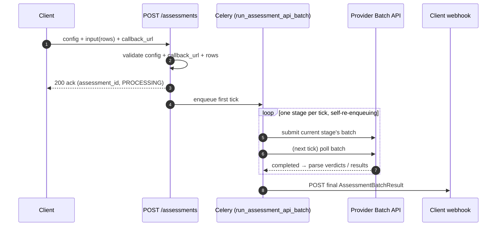
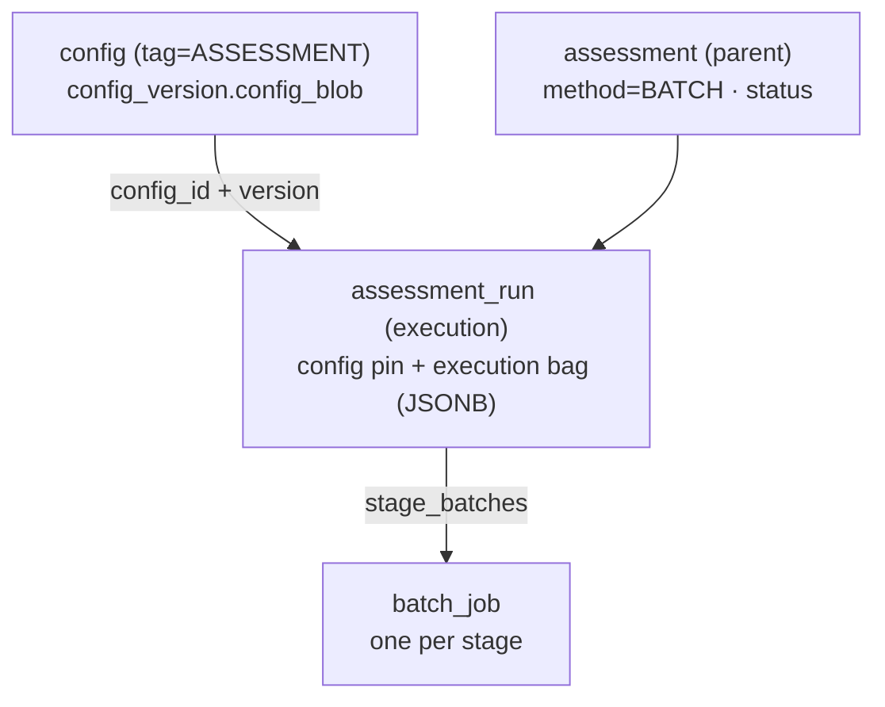
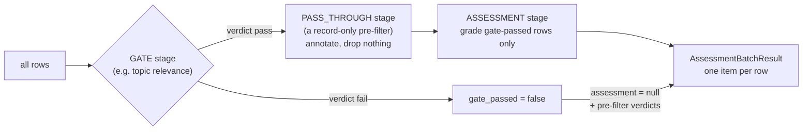
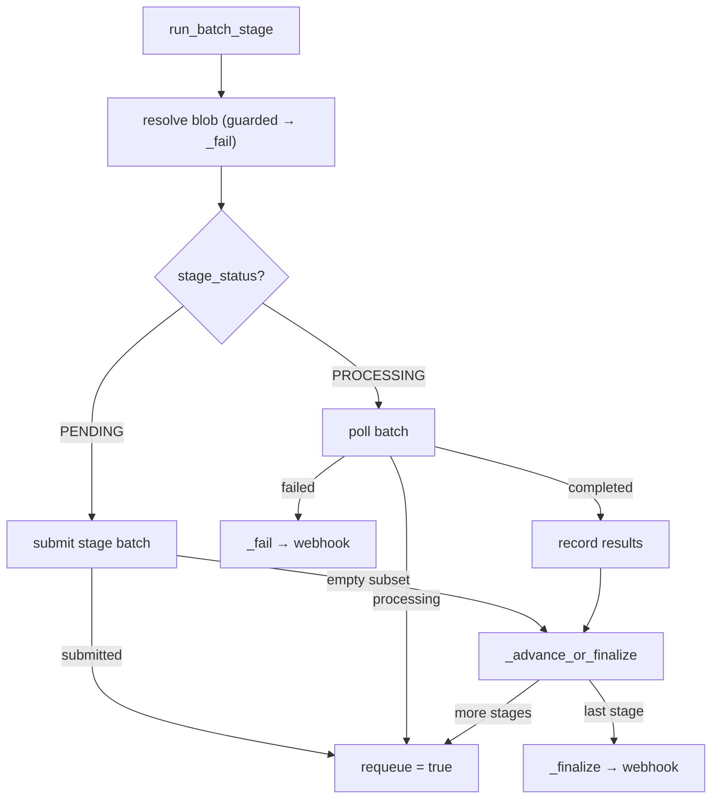

# Kaapi AI Assessments — Architecture Overview

> **New here?** Start with the user guides in [`assessment/`](assessment/README.md)
> (onboarding, configs, running an assessment). This document is the technical
> architecture of the **API-client** assessment surface.

## Purpose

The **AI Assessments** API-client lets a caller grade items with an LLM against a
saved rubric and receive a **structured result** (a caller-defined JSON object)
per item. It is a pure API surface — submit a request, get results delivered to a
**webhook**. There is no console/UI flow here.

The method is **inferred from the input shape**, never passed as a flag:

| Method | Input | Status |
|---|---|---|
| **BATCH** | a `data` list of rows | ✅ shipped |
| **RESPONSE** | a single item's `attachments` (no `data`) | 🚧 WIP — returns `501` |

This document describes the **BATCH** path (the one that is built) and notes the
RESPONSE path as WIP. Grading runs on a **provider Batch API** — OpenAI, Google
AI Studio (Gemini), or Anthropic. Google Cloud / Vertex is WIP.

Key properties:

- **Webhook-only delivery.** The request carries a required `callback_url`; the
  finished result is POSTed there. There is no status or result poll endpoint.
- **One config, one execution.** A request pins one `config_id + config_version`
  (tag `ASSESSMENT`) and creates one parent `assessment` + one `assessment_run`
  (the execution).
- **A staged pipeline, one provider batch per stage.** Optional gate/pass-through
  pre-filters run first, then the assessment stage grades only the rows that
  passed every gate.
- **Runtime state lives in one JSONB bag.** All pipeline state sits on
  `assessment_run.execution` (a `BatchRunState`); no dedicated columns.
- **Self-driving Celery loop.** A Celery task advances the pipeline one tick at a
  time and re-enqueues itself until the run is terminal — no external cron.

---

## 1. The high-level view



The server does no slow work: it validates and registers the request, then the
Celery task submits a batch, exits, and re-enqueues itself to poll later. When the
last stage completes, the result is delivered to the webhook.

See the [BATCH flow diagram](assessment/assets/batch-flow.png) for the
decision-level view.

---

## 2. Component map

```
backend/app/
├── api/routes/assessment/
│   └── api.py                     ★ POST /assessments (method inferred; RESPONSE → 501)
│
├── services/assessment/api/
│   ├── submission.py              ★ submit(): validate config + callback_url + rows,
│   │                                 persist assessment + execution, seed the bag, dispatch
│   ├── batch.py                   ★ the staged pipeline driver:
│   │                                 build_pipeline · run_batch_stage (one tick) ·
│   │                                 _submit_stage · _poll_outcome · _advance_or_finalize ·
│   │                                 _finalize · _fail · parse_batch_results
│   ├── results.py                 build_result → AssessmentBatchResult (one item per row)
│   └── callbacks.py               deliver(): POST the result via the SSRF-guarded send_callback
│
├── crud/assessment/
│   └── api.py                     create_assessment · create_execution · save_execution_state ·
│                                    set_execution_batch_job · update_status · list_executions
│
├── core/batch/                    shared provider batch infra
│   └── openai.py · gemini.py · anthropic.py   the three batch providers
│
├── celery/tasks/job_execution.py  run_assessment_api_batch (self-re-enqueues each tick)
│
└── models/
    ├── assessment/assessment_api.py   request/response models + BatchRunState (the bag)
    ├── assessment/assessment.py       Assessment · AssessmentRun tables · enums
    └── config/assessment_blob.py      AssessmentConfigBlob (input_schema + pre_filters + assessment)
```

`★` = read first: [submission.py](../../backend/app/services/assessment/api/submission.py)
is the entry point; [batch.py](../../backend/app/services/assessment/api/batch.py)
is the pipeline engine.

---

## 3. Data model



- **`assessment`** — one submission: `method`, aggregate `status`, org/project. For
  BATCH there is exactly one child execution.
- **`assessment_run`** — the execution: the config pin (`config_id + config_version`)
  and the **execution bag** on `execution` (JSONB).
- **The execution bag** (`BatchRunState`,
  [assessment_api.py](../../backend/app/models/assessment/assessment_api.py)) holds
  all runtime state: `pipeline`, current `stage` + `stage_status`, `stage_batches`
  (stage → batch id), `stage_output_urls`, per-stage `verdicts` and `counters`,
  the per-row `gate_passed` flags, `provider` / `model`, `input_schema`,
  `callback_url`, and `request_metadata`. Idempotent redelivery is keyed off
  `stage_status`.

The schema (UUID assessment id, method/status enums, the `execution` bag column)
is set up in migration `078_refactor_assessment_tables`.

---

## 4. The config

A run resolves one `ASSESSMENT`-tagged config into an `AssessmentConfigBlob`
([assessment_blob.py](../../backend/app/models/config/assessment_blob.py)):

- **`input_schema`** (required, top-level) — the typed submission columns
  (`{type, format}` per column). It is a sibling of `assessment` and `pre_filters`
  on the blob, **mandatory** and non-empty. Every `{column}` placeholder in any
  `submission` template must resolve against it — enforced at config-save time.
- **`assessment`** (required) — `provider` (`openai` / `google` / `anthropic`),
  `type: text`, and `params`: `model`, `instructions` (the rubric), a **mandatory**
  non-empty `submission` (the per-row `{column}` prompt template), and an optional
  `json_output_schema` (the structured result shape).
- **`pre_filters`** (optional) — `topic_relevance`. It is its own LLM call with its
  own `provider` + `params` (criteria live in `params.instructions`, **mandatory**;
  an optional `params.submission` template) and a `stop_on_fail` flag.

See **[configuration-and-versioning.md](assessment/configuration-and-versioning.md)** for the authoring guide.

---

## 5. The staged pipeline

`build_pipeline` ([batch.py](../../backend/app/services/assessment/api/batch.py))
compiles the config's pre-filters into an ordered stage list, by kind
(`GATE pre-filters → PASS_THROUGH pre-filters → ASSESSMENT`), and rows flow
through it like this:



- **GATE** (`stop_on_fail: true`, e.g. topic relevance) — runs on every row; a
  failing verdict marks that row `gate_passed = false`.
- **PASS_THROUGH** (`stop_on_fail: false`, a record-only pre-filter) — runs on
  every row, records a verdict, drops nothing.
- **ASSESSMENT** — always last; batches **only** `gate_passed` rows. Gate-failed
  rows carry `assessment: null` plus their pre-filter verdicts into the result.

### One tick = `run_batch_stage`

Each Celery invocation runs one tick and returns `{"requeue": bool}`:



- **Submit** a `PENDING` stage's batch, then requeue to poll it next tick.
- **Poll** a `PROCESSING` stage; on completion, record verdicts/results and
  `_advance_or_finalize` to the next stage — or `_finalize` if it was the last.
- **Empty subset** (all rows gated out): the stage submits no batch and
  `_advance_or_finalize` moves on — which, for the last stage, finalizes and fires
  the webhook (no livelock).

The task [`run_assessment_api_batch`](../../backend/app/celery/tasks/job_execution.py)
re-enqueues itself at `POLL_COUNTDOWN_SECONDS` whenever `requeue` is true, and
stops once the run is terminal.

---

## 6. Results & delivery

- `build_result` ([results.py](../../backend/app/services/assessment/api/results.py))
  assembles an `AssessmentBatchResult`: `total_items`, `counts`
  (`assessed` / `filtered` / `errors`), and one `AssessmentResult` per row —
  `{ output: { assessment, pre_filter }, error }`. Gate-failed rows are included
  with `assessment: null`.
- `_finalize` sets the terminal status and calls
  `deliver` ([callbacks.py](../../backend/app/services/assessment/api/callbacks.py)),
  which POSTs an `AssessmentCallback` (`{ assessment_id, status, data,
  request_metadata }`) to the client `callback_url` via the shared
  **SSRF-guarded, HMAC-signed** `send_callback`.

The result body carries no per-call `metadata` block — only the graded outputs,
pre-filter verdicts, and counts.

---

## 7. Failure modes

| Concern | Behaviour |
|---|---|
| **Async model** | Provider Batch APIs do all model work; Celery only builds/submits and polls. |
| **Webhook-only** | Results are delivered to `callback_url`; there is no poll endpoint. `callback_url` is validated (HTTPS + SSRF guard) at submit, so a bad URL is rejected `422` up front. |
| **All rows gated out** | The assessment stage submits no batch and the run finalizes with an all-gated result (still delivered). |
| **Non-transient tick error** | A bad/deleted config version or a provider/credential/network error during submit routes through `_fail` → status `FAILED` + a failure webhook. |
| **Transient poll error** | A provider/network hiccup while polling just retries next tick — a running batch is never failed for a transient error. |
| **Idempotent redelivery** | State is keyed off `stage_status`, so a duplicate Celery delivery re-polls or re-submits the same stage safely. |
| **Per-row validation** | Rows are validated against `input_schema` at submit; a missing/extra column or a non-URL attachment fails `422`, naming the row. Template placeholders are validated earlier, at config-save: every `{column}` in any `submission` must resolve against `input_schema`, or the save is rejected. |

---

## 8. RESPONSE method 🚧 (WIP)

A single-item, low-latency path (one item's `attachments` → one `AssessmentResult`,
optionally via an LLM-chain when pre-filters are configured) is planned. It is not
built — the route returns `501` for RESPONSE-shaped input. See the
[planned RESPONSE flow](assessment/assets/response-flow.png).

---

## Related

- **[assessment/README.md](assessment/README.md)** — the user-facing getting-started
  guide, config authoring, and how to run an assessment.
- `kaapi-llm-call-ARCHITECTURE.md` — the production single-call endpoint whose
  versioned config store backs assessment configs (`tag=ASSESSMENT`).
