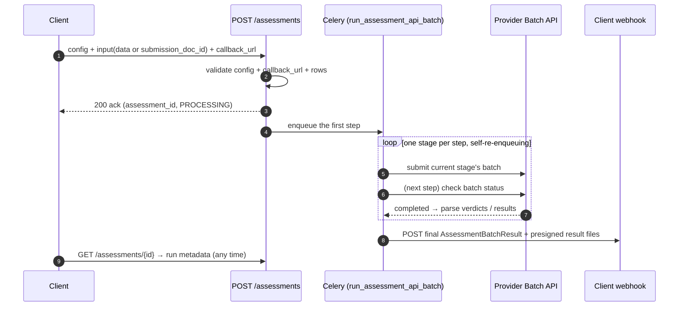
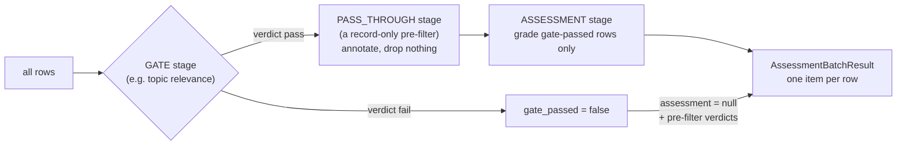
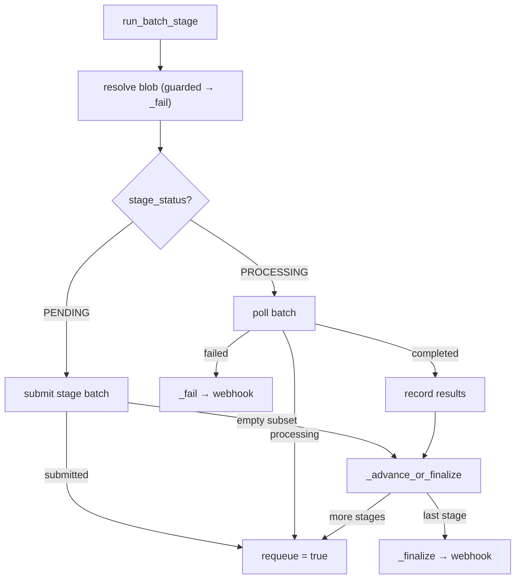
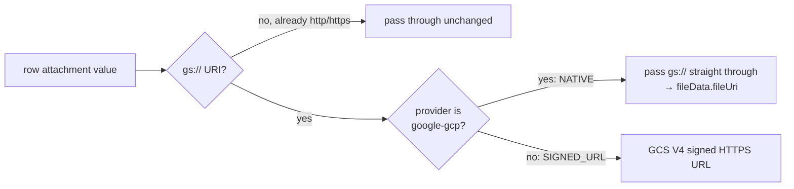
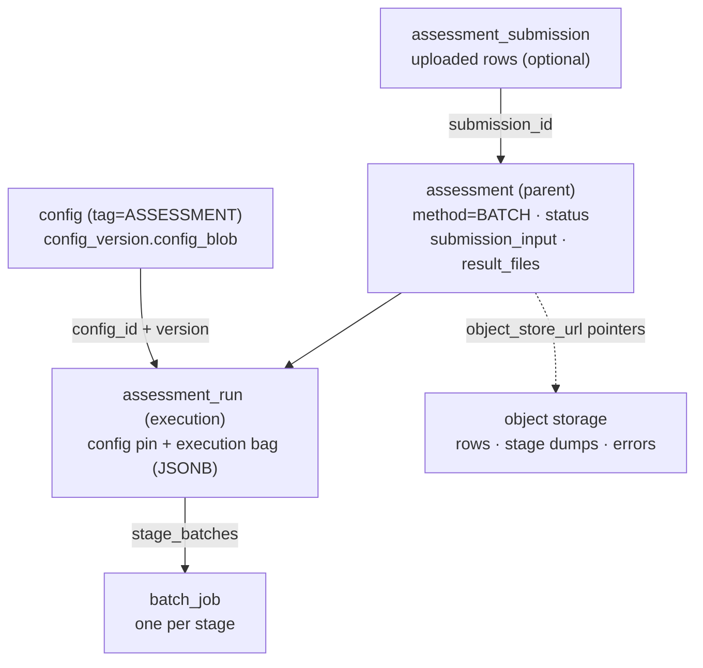
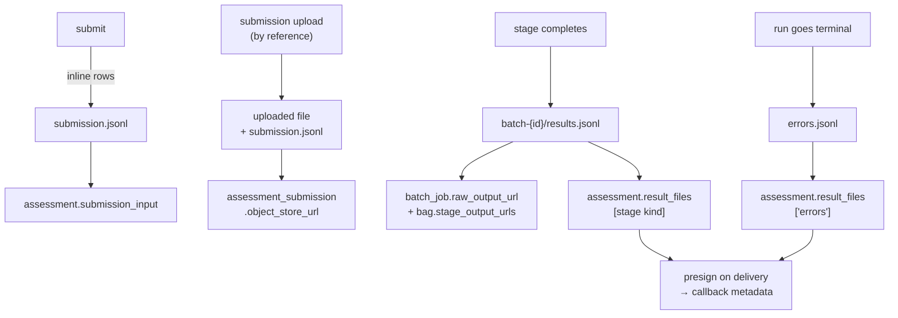

# Kaapi AI Assessments — Architecture Overview

## Purpose

### What an assessment is

An **assessment** applies a **rubric** to a batch of **submissions** using an LLM,
and returns one structured record per submission. A *submission* is a single item
to be judged; a *rubric* is the written standard to judge it by, supplied as the
model's instructions.

What makes this an API rather than a script is that **all three axes are the
caller's to define** — the module itself is domain-agnostic:

| Axis | Defined by | Means |
|---|---|---|
| **What goes in** | `input_schema` | your own columns, each typed `text`, `image`, `pdf` or `video`. An attachment column carries a url or base64 (`video` is url-only), so a submission can be prose, a scanned or handwritten document, a photo, or a recording. **`video` is supported only on the Google Gemini models** (`google-aistudio` / `google-gcp`); the other providers take text, image and pdf. |
| **What comes out** | `json_output_schema` | the exact JSON shape every row must return — per-criterion scores, the model's reasoning, free-text feedback for the submitter, a verdict flag: whatever fields you declare. |
| **Who judges** | `assessment.provider` + `params.model` | the provider and model that run the grading call. |

The structured output is the load-bearing part. Scores that come back in a
declared shape can be summed, ranked, filtered and routed; the same answer as
free prose cannot, without fragile parsing. It is also what lets a run return
usable feedback per submission rather than only a number — so the output can go
back to whoever made the submission, not just to whoever is scoring it.

### Why it exists

Assessments are used to evaluate multiple submissions in bulk. The pipeline is
flexible and can be adapted to different use cases. Each run consists of blocks:
optional pre-filters, such as `topic_relevance`, which checks whether a submission
is relevant, and a mandatory assessment block that handles the actual grading. Any
submission rejected by a pre-filter does not proceed to the assessment block (§5).

### TL;DR of the mechanics

The caller sends rows along with a config ID/version and a `callback_url`. Kaapi
validates the data, stores it in S3 for a limited time, and starts a Celery task
to process the run step by step. It first runs any optional pre-filters and then
moves to grading, submitting **one batch per stage** and waiting for that batch to
finish before starting the next — never more than one batch in flight per run. The
task re-enqueues itself until the whole pipeline is complete, then Kaapi sends the
results to the provided webhook.

The sections below follow the path a request actually takes: **input** (§3) →
**config** (§4) → **staged pipeline** (§5) → the **state** it keeps (§6) and
**where content lives** (§7) → **delivery** (§8) → **failure modes** (§9).

---

## 1. The high-level view


```mermaid
sequenceDiagram
    autonumber
    participant C as Client
    participant S as POST /assessments
    participant W as Celery (run_assessment_api_batch)
    participant P as Provider Batch API
    participant Hook as Client webhook

    C->>S: config + input(data or submission_doc_id) + callback_url
    S->>S: validate config + callback_url + rows
    S-->>C: 200 ack (assessment_id, PROCESSING)
    S->>W: enqueue the first step
    loop one stage per step, self-re-enqueuing
        W->>P: submit current stage's batch
        W->>P: (next step) check batch status
        P-->>W: completed → parse verdicts / results
    end
    W->>Hook: POST final AssessmentBatchResult + presigned result files
    C->>S: GET /assessments/{id} → run metadata (any time)
```

`POST /assessments` is **asynchronous**: it validates the request, persists the
assessment, invokes the Celery task, and returns immediately with a `200` ack
(`assessment_id`, `status: PROCESSING`) — it never waits on a model. From there the
Celery task owns the run: it submits a batch, exits, and re-enqueues itself to
check on it later. When the last stage completes the run goes terminal, its result
files are persisted, and the result is POSTed to the `callback_url`.
`GET /assessments/{id}` can be called at any point for run metadata — where the
run is and whether it is done — but it does not carry the graded rows.

---

## 2. Component map

```text
backend/app/
├── api/routes/assessment/
│   └── api.py                     ★ POST /assessments · GET /assessments · GET /assessments/{id}
│
├── services/assessment/api/
│   ├── submission.py              ★ submit(): validate config + callback_url + rows,
│   │                                 persist assessment + execution, seed the bag, dispatch
│   ├── batch.py                   ★ the staged pipeline driver:
│   │                                 build_pipeline · run_batch_stage (one step) ·
│   │                                 _submit_stage · _poll_outcome · _advance_or_finalize ·
│   │                                 _finalize · _fail · parse_batch_results
│   ├── results.py                 build_result / build_summary → one item per row
│   ├── submission_store.py        the rows' object-store round trip (upload + stream back)
│   ├── result_files.py            per-stage dumps · errors.jsonl · presigned callback metadata
│   └── callbacks.py               deliver(): POST the result via the SSRF-guarded send_callback
│
├── crud/assessment/
│   ├── api.py                     create_assessment · create_execution · save_execution_state ·
│   │                                set_execution_batch_job · set_result_files · update_status
│   └── submission.py              assessment_submission CRUD (rows submitted by reference)
│
├── services/assessment/validators.py   the storage key helpers (§7.2) + row/column validation
│
├── core/batch/                    shared provider batch infra
│   └── openai.py · gemini.py · anthropic.py   the three batch providers
│
├── celery/tasks/job_execution.py  run_assessment_api_batch (self-re-enqueues per step)
│
└── models/
    ├── assessment/assessment_api.py   request/result models + BatchRunState (the bag)
    ├── assessment/assessment.py       Assessment · AssessmentRun tables · enums
    └── config/assessment_blob.py      AssessmentConfigBlob (input_schema + pre_filters + assessment)
```

`★` = read first: [submission.py](../../backend/app/services/assessment/api/submission.py)
is the entry point; [batch.py](../../backend/app/services/assessment/api/batch.py)
is the pipeline engine.

---

## 3. Input

A request carries the rows to grade, a pinned config, and a `callback_url`.

Rows come from one of two mutually exclusive fields:

| Field | Rows |
|---|---|
| `input.data` | a list of submission rows in the request body |
| `input.submission_doc_id` | an uploaded submission file to read the rows from |

`submit` ([submission.py](../../backend/app/services/assessment/api/submission.py))
resolves whichever was given into the same list of rows, then validates up front so
a bad request fails at submit rather than mid-run:

- **`callback_url`** — HTTPS + SSRF/private-IP guard; a bad url is `422`.
- **Every row against the config's `input_schema`** — a missing or extra column is
  `422`, naming the row.
- **Attachment shapes** — each attachment value (`image` / `pdf` / `video`) must be
  an `http(s)://` url or a `gs://bucket/key` reference, `422` otherwise.

Only inline rows are copied into object storage; a `submission_doc_id` already
points at an immutable file, so the run reads it in place. Either way the pipeline
reads rows through one helper (§7.1).

Grading then runs over a series of **provider batch** jobs. Supported providers:

| Provider | Batch backend |
|---|---|
| `openai` | OpenAI Batch |
| `google-aistudio` | Gemini Batch API (AI Studio) |
| `google-gcp` | Vertex AI batch prediction |
| `anthropic` | Message Batches |

---

## 4. The config

A run resolves one `ASSESSMENT`-tagged config into an `AssessmentConfigBlob`
([assessment_blob.py](../../backend/app/models/config/assessment_blob.py)):

- **`input_schema`** (required, top-level) — the typed submission columns
  (`{type, format}` per column). It is a sibling of `assessment` and `pre_filters`
  on the blob, **mandatory** and non-empty. Every `{column}` placeholder in any
  `submission` template must resolve against it — enforced at config-save time.
- **`assessment`** (required) — `provider` (`openai` / `google-aistudio` /
  `google-gcp` / `anthropic`), `type: text`, and `params`: `model`, `instructions`
  (the rubric), a **mandatory** non-empty `submission` (the per-row `{column}`
  prompt template), and an optional `json_output_schema` (the structured result
  shape).
- **`pre_filters`** (optional) — `topic_relevance`. It is its own LLM call with its
  own `provider` + `params` (criteria live in `params.instructions`, **mandatory**;
  an optional `params.submission` template) and a `stop_on_fail` flag.

### Versioning

A config is **never edited in place** — each change adds a version, and an
assessment pins the exact `config_id + config_version` it ran with, so a later
edit cannot change a result that already completed.

- The `tag` is fixed at creation and cannot change, so every version of a config
  keeps the `ASSESSMENT` shape.
- **Sharp edge:** deleting a version is a soft delete with **no reference check**.
  A soft-deleted version drops out of lookups, so an execution that pinned it
  fails to resolve its config on a later step and routes through `_fail`.

---

## 5. The staged pipeline

`build_pipeline` ([batch.py](../../backend/app/services/assessment/api/batch.py))
compiles the config's pre-filters into an ordered stage list, by kind
(`GATE pre-filters → PASS_THROUGH pre-filters → ASSESSMENT`), and rows flow
through it like this:


```mermaid
flowchart LR
    Rows["all rows"] --> Gate{"GATE stage\n(e.g. topic relevance)"}
    Gate -->|verdict pass| PT["PASS_THROUGH stage\n(a record-only pre-filter)\nannotate, drop nothing"]
    Gate -->|verdict fail| Gated["gate_passed = false"]
    PT --> Assess["ASSESSMENT stage\ngrade gate-passed rows only"]
    Assess --> Res["AssessmentBatchResult\none item per row"]
    Gated -->|assessment = null\n+ pre-filter verdicts| Res
```

- **GATE** (`stop_on_fail: true`, e.g. topic relevance) — runs on every row; a
  failing verdict marks that row `gate_passed = false`.
- **PASS_THROUGH** (`stop_on_fail: false`, a record-only pre-filter) — runs on
  every row, records a verdict, drops nothing.
- **ASSESSMENT** — always last; batches **only** `gate_passed` rows. Gate-failed
  rows carry `assessment: null` plus their pre-filter verdicts into the result.

### One step = `run_batch_stage`

Each Celery invocation runs one step and returns `{"requeue": bool}`:


```mermaid
flowchart TD
    Start["run_batch_stage"] --> Res["resolve blob (guarded → _fail)"]
    Res --> St{"stage_status?"}
    St -->|PENDING| Sub["submit stage batch"]
    Sub -->|submitted| RQ["requeue = true"]
    Sub -->|empty subset| Adv["_advance_or_finalize"]
    St -->|PROCESSING| Poll["poll batch"]
    Poll -->|processing| RQ
    Poll -->|failed| Fail["_fail → webhook"]
    Poll -->|completed| Rec["record results"] --> Adv
    Adv -->|more stages| RQ
    Adv -->|last stage| Fin["_finalize → webhook"]
```

- **Submit** a `PENDING` stage's batch, then requeue to check it on the next step.
- **Check** a `PROCESSING` stage's batch; on completion, record verdicts/results
  and `_advance_or_finalize` to the next stage — or `_finalize` if it was the last.
- **Empty subset** (all rows gated out): the stage submits no batch and
  `_advance_or_finalize` moves on — which, for the last stage, finalizes the run
  (no livelock).

The task [`run_assessment_api_batch`](../../backend/app/celery/tasks/job_execution.py)
re-enqueues itself after `POLL_COUNTDOWN_SECONDS` whenever `requeue` is true, and
stops once the run is terminal. That constant is currently derived from the
`CRON_INTERVAL_MINUTES` setting — a naming leftover, not a cron: nothing schedules
this task but the task itself.

Each invocation takes the execution row with `SELECT ... FOR UPDATE SKIP LOCKED`,
so a second delivery for the same execution returns immediately instead of
double-submitting a stage.

### Attachment resolution (`gs://` vs signed URL)

An attachment column's value is either an `http(s)://` URL or a `gs://bucket/key`
GCS reference — `input.data` submit-time validation
([submission.py](../../backend/app/services/assessment/api/submission.py))
requires one of those prefixes for every attachment column (`image` / `pdf` /
`video`), `422` otherwise.

`gs://` values are resolved once per stage, at batch-build time, by
[`rewrite_gcs_attachment_urls`](../../backend/app/services/assessment/utils/attachments.py)
→ [`resolve_attachments`](../../backend/app/services/buckets/attachments.py), which
picks a strategy **per LLM provider**:


```mermaid
flowchart LR
    Row["row attachment value"] --> Check{"gs:// URI?"}
    Check -->|no, already http/https| Pass["pass through unchanged"]
    Check -->|yes| Prov{"provider is\ngoogle-gcp?"}
    Prov -->|yes: NATIVE| Native["pass gs:// straight through\n→ fileData.fileUri"]
    Prov -->|no: SIGNED_URL| Sign["GCS V4 signed HTTPS URL"]
```

- **NATIVE** — when the run's provider is `google-gcp` (Vertex), the raw `gs://`
  string goes straight into the Vertex batch request's `fileData.fileUri` field;
  the provider reads the object from GCS itself, no signing.
- **SIGNED_URL** — for every other provider (`openai`, `anthropic`,
  `google-aistudio`), each distinct `gs://` URI in the stage is converted to a time-limited
  GCS **V4 signed HTTPS URL** and the provider fetches it over HTTPS. All `gs://`
  URIs in a stage are deduplicated and signed in **one bulk call**
  (`GCSBucketProvider.get_bulk_signed_urls`), not per-row.
- **Passed by reference, not uploaded** — the provider always fetches the
  URL/URI itself; there is no base64 encoding or file-upload path in this flow.
- **Signed URL lifetime is fixed at 24h** (`MAX_SIGNED_URL_EXPIRY_SECONDS`) —
  this is both the requested expiry and the hard cap; there is no config path to
  a longer expiry today, even though GCS V4 signed URLs support up to 7 days.
- The GCS service account backing the run's `google-gcp` credential needs
  `storage.objects.get` on the bucket for either path (native reads or signing).

---

## 6. Data model


```mermaid
flowchart TD
    Cfg["config (tag=ASSESSMENT)\nconfig_version.config_blob"]
    Sub["assessment_submission\nuploaded rows (optional)"]
    A["assessment (parent)\nmethod=BATCH · status\nsubmission_input · result_files"]
    R["assessment_run (execution)\nconfig pin + execution bag (JSONB)"]
    BJ["batch_job\none per stage"]
    S3["object storage\nrows · stage dumps · errors"]

    Cfg -->|config_id + version| R
    Sub -->|submission_id| A
    A --> R
    R -->|stage_batches| BJ
    A -.->|object_store_url pointers| S3
```

- **`assessment`** — one submission: `method`, aggregate `status`, org/project. For
  BATCH there is exactly one child execution. It also carries the two storage
  pointers: **`submission_input`** (the object-store url of the rows, when they
  were sent inline) and **`result_files`** (a JSONB map of
  `kind → {object_store_url}`, filled in as stages complete).
- **`assessment_submission`** — rows submitted **by reference** instead of inline:
  an uploaded CSV/XLSX with a `name`, `total_items`, and its `object_store_url`.
  An assessment then points at it with `submission_id` and leaves
  `submission_input` null. Either way the pipeline reads rows through one helper
  (§7.1).
- **`assessment_run`** — the execution: the config pin (`config_id + config_version`)
  and the **execution bag** on `execution` (JSONB).
- **The execution bag** (`BatchRunState`,
  [assessment_api.py](../../backend/app/models/assessment/assessment_api.py)) holds
  all runtime state: `pipeline`, current `stage` + `stage_status`, `stage_batches`
  (stage → batch id), `stage_output_urls`, per-stage `verdicts` and `counters`,
  the per-row `gate_passed` flags, `provider` / `model`, `input_schema`,
  `callback_url`, and `request_metadata`. Idempotent redelivery is keyed off
  `stage_status`.

---

## 7. Persistence & storage layout

Assessment data is split on purpose: **Postgres holds the state machine and
pointers, object storage holds the content.** No submission row and no model
output is ever written to a database column.

### 7.1 What lives where

| Store | Holds | Never holds |
|---|---|---|
| `assessment` | method, status, the two storage pointers (`submission_input`, `result_files`), optional `experiment_name`, org/project | row values, model outputs |
| `assessment_run` | config pin, `total_items`, `batch_job_id`, the **execution bag** (`execution` JSONB: pipeline, stage, stage_status, stage_batches, stage_output_urls, verdicts, counters, `gate_passed` flags, provider/model, input_schema, callback_url, request_metadata) | row values, graded outputs |
| `assessment_submission` | an uploaded submission's `name`, `description`, `total_items`, `object_store_url` | the rows themselves |
| `batch_job` | provider ids, provider status, the config used, `raw_output_url` | request or response bodies |
| Object storage | the submission rows, each stage's provider dump, the run's error dump | — |

Two things follow. First, **per-row verdict bookkeeping is the one exception**:
the bag keeps compact per-row state (gate verdicts and `gate_passed` flags), which
is how a gated row can be accounted for without re-reading any dump. Second,
reading a row's *input* or *output* always costs an object-storage read — which is
why the read endpoints stay metadata-level and the graded rows travel in the
callback instead (§8).

Rows are read through a single helper, `open_submission_rows`
([submission_store.py](../../backend/app/services/assessment/api/submission_store.py)),
which streams JSONL and hides where the rows came from: an inline BATCH reads its
own copy at `assessment.submission_input`, while one submitted by reference reads
the uploaded submission's parsed rows directly, since that file never changes. A
storage failure here raises `SubmissionUnavailableError`, which the pipeline treats
as retryable rather than fatal.

### 7.2 Object-storage layout

Every object is written through
[core/cloud/storage.py](../../backend/app/core/cloud/storage.py), which is
**project-scoped by construction**: the storage client is built with the project's
`storage_path` (a UUID on the `project` row) and prefixes every key with it. Paths
must be relative — an absolute one is rejected — so code cannot write outside its
own project's prefix. The key helpers all live in
[services/assessment/validators.py](../../backend/app/services/assessment/validators.py)
(`assessment_prefix`, `stage_batch_prefix`, `submission_prefix`,
`submission_rows_url`); nothing builds a key by hand.

```
{bucket}/{project.storage_path}/
├── assessment/
│   └── {assessment_id}/                      ← everything one assessment produces
│       ├── submission.jsonl                  ← the rows, when sent inline
│       ├── batch-{batch_job_id}/
│       │   └── results.jsonl                 ← one stage's raw provider dump
│       └── errors.jsonl                      ← the run's error dump (terminal time)
└── assessment/submissions/
    └── {submission_id}/
        ├── {uploaded file}.csv|xlsx          ← the upload, byte-for-byte
        └── submission.jsonl                  ← rows parsed from it at upload
```

When each object is written, and what records it:


```mermaid
flowchart TD
    Sub["submit"] -->|inline rows| SJ["submission.jsonl"]
    SJ --> P1["assessment.submission_input"]
    Up["submission upload\n(by reference)"] --> UF["uploaded file\n+ submission.jsonl"]
    UF --> P2["assessment_submission\n.object_store_url"]
    St["stage completes"] --> SD["batch-{id}/results.jsonl"]
    SD --> P3["batch_job.raw_output_url\n+ bag.stage_output_urls"]
    SD --> P4["assessment.result_files\n[stage kind]"]
    Fin["run goes terminal"] --> EJ["errors.jsonl"]
    EJ --> P5["assessment.result_files\n['errors']"]
    P4 --> Sign["presign on delivery\n→ callback metadata"]
    P5 --> Sign
```

| Object | Written by | Pointer |
|---|---|---|
| `submission.jsonl` (inline rows) | `upload_submission_rows` at submit | `assessment.submission_input` |
| `{uploaded file}` + its `submission.jsonl` | the submission upload path | `assessment_submission.object_store_url` |
| `batch-{id}/results.jsonl` | `process_completed_batch`, with `stage_batch_prefix` overriding the default prefix | `batch_job.raw_output_url`, and `stage_output_urls[stage]` in the bag |
| `errors.jsonl` | `build_and_upload_errors` at terminal time | `assessment.result_files["errors"]` |

- **One dump per stage, per assessment.** A stage's dump is recorded on the parent
  as soon as that stage completes (`record_stage_dump`), so a long run's earlier
  stages are already durable before the run ends. `result_files` keys by *kind*:
  the assessment stage's dump is `results`, a pre-filter's is
  `{stage}_results`, and the error dump is `errors`.
- **`errors.jsonl` is self-describing.** Each line carries a `type` tag
  (`execution_error`, `row_error`, `provider_error_file`,
  `provider_error_file_unavailable`), so execution-level failures, per-row parse
  errors, and the provider's own error file all land in one readable artifact.
- **`finalize_result_files` is idempotent** — a re-merge replaces only its own
  kinds — so a redelivered step cannot corrupt the record.
- **Presigned, never public.** Result files are handed out only as time-limited
  signed URLs in the callback metadata, capped at
  `MAX_SIGNED_URL_EXPIRY_SECONDS` (24h, which is also the storage layer's own
  ceiling). The stored objects themselves stay private.
- **Attachment bytes are never stored.** Images and PDFs are passed to the
  provider by URL or `gs://` reference (§5); Kaapi neither downloads nor caches
  them, so no submission media exists in the bucket.
- **Retention.** An assessment's objects — the stored rows, the stage dumps and
  the error dump — are not meant to live forever: they are reaped by an **object
  lifecycle rule** on the prefix, the same mechanism that already expires the
  `pending` upload holding area (`PENDING_TTL_DAYS` in
  [storage.py](../../backend/app/core/cloud/storage.py)). The DB rows that point
  at them outlive the objects, so a pointer can outlive its file — a read after
  expiry fails rather than returning stale content.

---

## 8. Results & delivery

- `build_result` ([results.py](../../backend/app/services/assessment/api/results.py))
  assembles an `AssessmentBatchResult`: `total_items`, `counts`
  (`assessed` / `filtered` / `errors`), and one `AssessmentResult` per row —
  `{ output: { assessment, pre_filter }, error }`. Gate-failed rows are included
  with `assessment: null`.
- `_finalize` derives the terminal status from the items (all rows errored →
  `FAILED`, some → `COMPLETED_WITH_ERRORS`, none → `COMPLETED`), persists the
  run's result files, and **only then** considers delivery.
- **Delivery** — `deliver` ([callbacks.py](../../backend/app/services/assessment/api/callbacks.py))
  POSTs an `AssessmentCallback` (`{ assessment_id, status, data,
  request_metadata }`) through the shared **SSRF-guarded, HMAC-signed**
  `send_callback`. One inline attempt, no retry.
- **The callback envelope's `metadata` carries the result files**, not the rows:
  `build_callback_metadata` presigns every recorded result file into
  `{result_files: {kind: {signed_url}}, expires_at}`. A presign failure drops that
  one entry rather than the whole envelope, and a metadata failure delivers the
  result without it — the client never loses a result to a metadata bug.
- **The read endpoints are metadata-level only.** `GET /assessments/{assessment_id}`
  reports where a run is — status and run-level progress — and
  `GET /assessments` lists BATCH assessments newest-first, optionally narrowed to
  one `config_id` / `version`. Neither is a result channel: graded rows arrive in
  the callback, and the result files themselves are reached through the presigned
  urls in its `metadata`.

---

## 9. Failure modes

| Concern | Behaviour |
|---|---|
| **Async model** | Provider Batch APIs do all model work; Celery only builds/submits and polls. |
| **Delivery** | The callback is the result channel, so `callback_url` is validated (HTTPS + SSRF guard) at submit — a bad URL is rejected `422` up front rather than stranding a finished run with nowhere to send it. Delivery is one inline attempt with no retry; the result files stay on the assessment, so a missed callback is recoverable from storage rather than lost. |
| **All rows gated out** | The assessment stage submits no batch and the run finalizes with an all-gated result (still delivered). |
| **Non-transient step error** | A bad/deleted config version or a provider/credential/network error during submit routes through `_fail` → status `FAILED`, result files persisted, and a failure callback if one was configured. |
| **Transient status-check error** | A provider/network hiccup while checking a batch just retries on the next step — a running batch is never failed for a transient error. Likewise an unreadable stored submission leaves the stage `PENDING` and requeues. |
| **Duplicate task delivery** | Each step takes the execution row with `SELECT ... FOR UPDATE SKIP LOCKED`, so a concurrent delivery for the same execution returns without doing anything. A later (non-concurrent) redelivery is keyed off `stage_status` in the bag: it re-checks an in-flight batch or re-submits a stage that was never dispatched. Terminal runs exit immediately on status. `_finalize` / `_fail` carry no delivery marker, so a duplicate step that lands after completion can still send a second callback — clients should treat `assessment_id` as the idempotency key. |
| **Result-file durability** | `finalize_result_files` never raises: it persists what it can and logs the rest, and runs before delivery is considered. A failed dump upload costs that file, not the run — the run still goes terminal and still delivers. |
| **Per-row validation** | Rows are validated against `input_schema` at submit; a missing/extra column or a non-URL attachment fails `422`, naming the row. Template placeholders are validated earlier, at config-save: every `{column}` in any `submission` must resolve against `input_schema`, or the save is rejected. |

---

## Related

- `kaapi-evaluations-ARCHITECTURE.md` — the sibling module that points the other
  way (scoring a model against known-correct answers, rather than scoring
  submissions) and shares the `core/batch/` provider layer.
- `kaapi-llm-call-ARCHITECTURE.md` — the production single-call endpoint whose
  versioned config store backs assessment configs (`tag=ASSESSMENT`).
