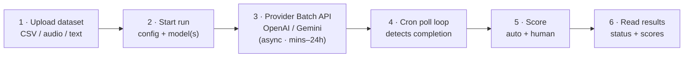
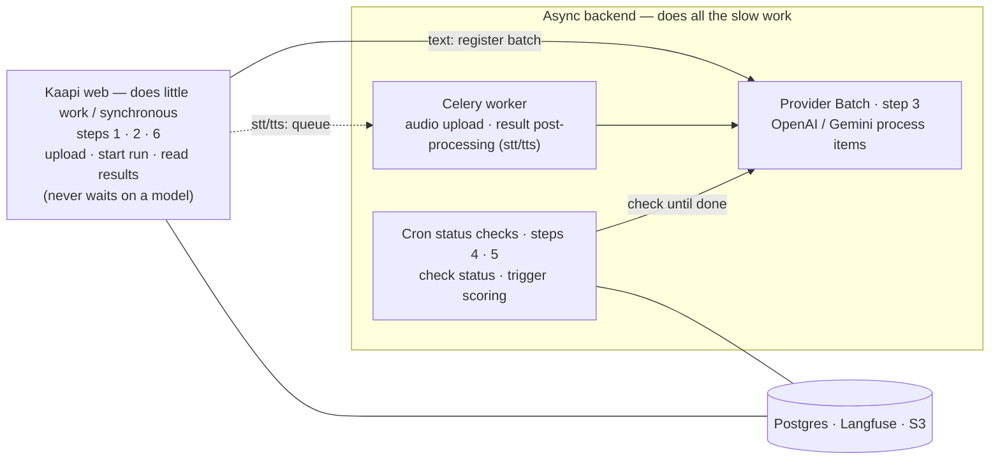
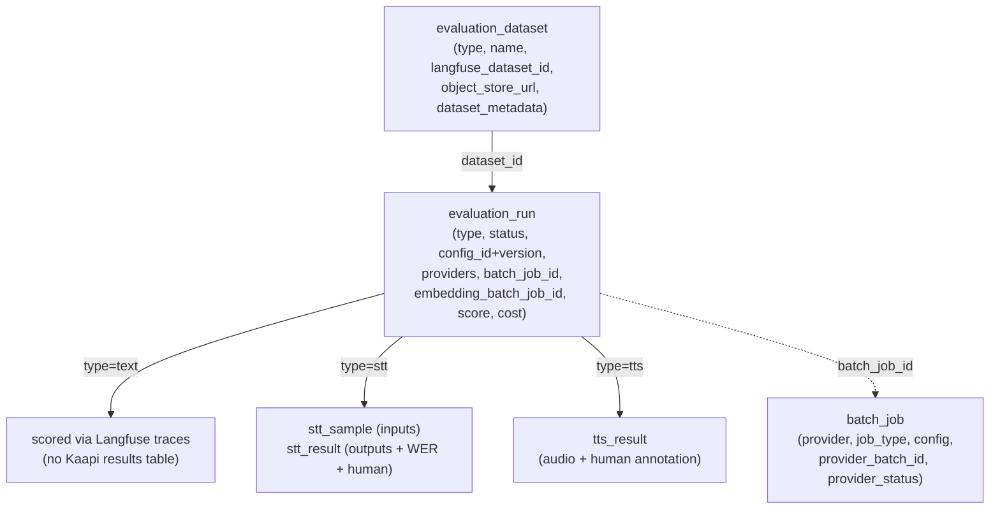
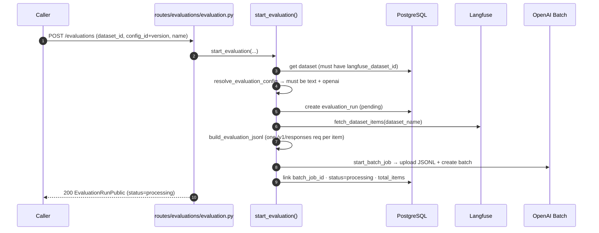
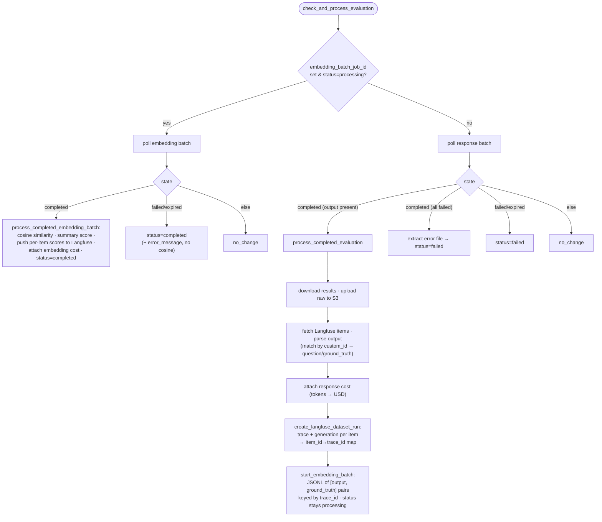
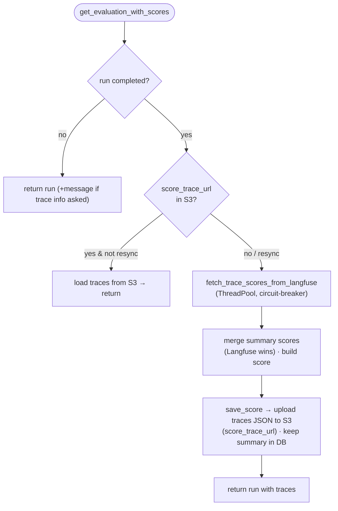
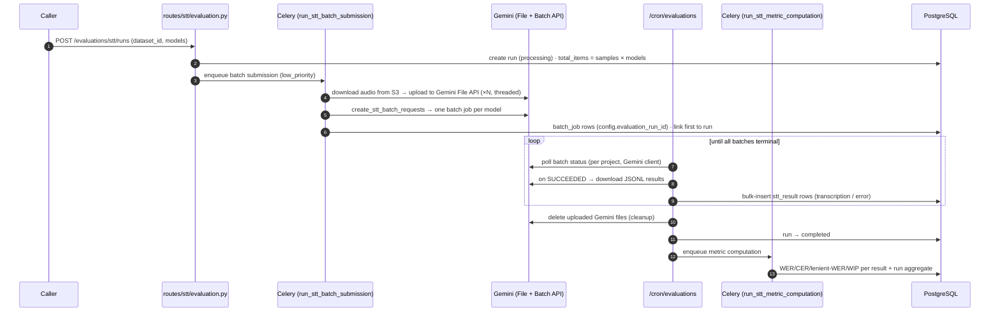
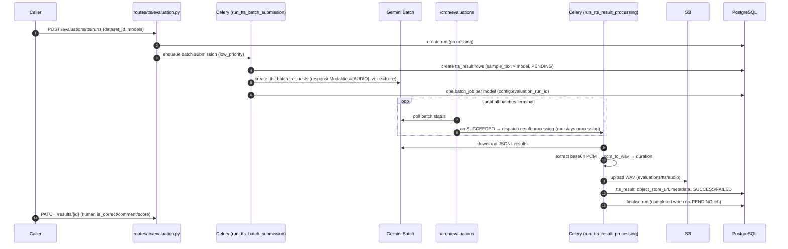
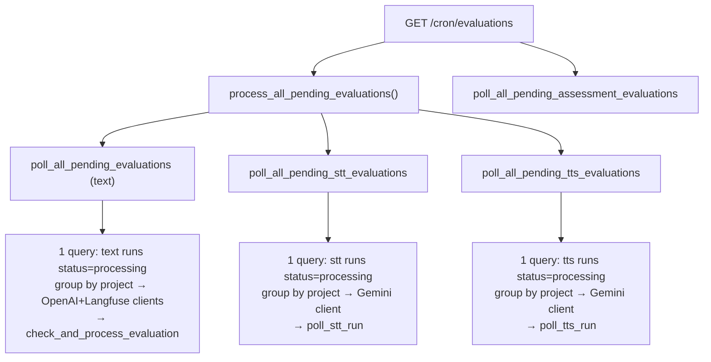
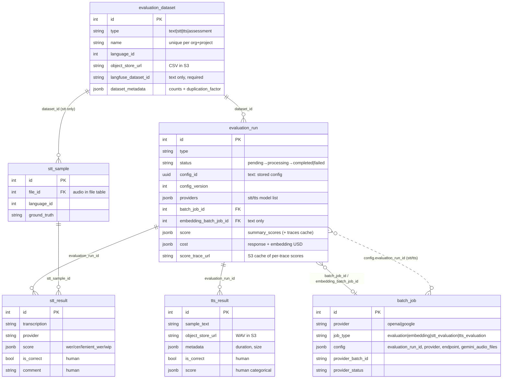

# Kaapi Evaluations — Architecture Overview

## Purpose

The **Evaluations** module lets a one measure _how good_ an LLM
configuration is on a curated dataset of golden examples — before that
config is ever used in production via `POST /llm/call`. A caller uploads a
**dataset** (golden Q&A pairs, or audio samples, or text-to-speech samples),
starts an **evaluation run** on it together with the config/model(s) to test,
and Kaapi:

1. uses the dataset and config to prepare one request to the provider per item,
   then groups those requests into a **provider batch**,
2. sends the batch to the provider's **Batch API**, where all requests are
   clubbed together and processed in one go, asynchronously (up to a 24h window),
3. **checks for completion** repeatedly using a scheduled cron job,
4. **scores** the outputs — automatically where possible, by human annotation
   where not, and
5. returns per-item traces and aggregate scores back to the caller (and to the
   Kaapi console UI).

It spans three evaluation _families_, all sharing one dataset/run schema:

- **`text`** — golden question → expected answer. Scored automatically by
  **embedding cosine similarity** and **LLM-as-judge**. **OpenAI only** today
  (File Search / RAG supported).
- **`stt`** (speech-to-text) — audio sample → reference transcription. Scored
  automatically by **WER / CER / lenient-WER / WIP** (with Indic-aware
  normalisation), plus optional **human feedback**. **Gemini only**.
- **`tts`** (text-to-speech) — text → synthesised audio. **No automated metric
  yet** — relies on **human annotation** in the console UI. **Gemini only**.

Key architectural properties:

- **Batch-first, not `/llm/call`-first.** Evals deliberately do _not_ route
  through the live `/llm/call` endpoint. They use each provider's **Batch API**
  (OpenAI Batch, Gemini Batch) so that tens-to-hundreds of eval requests never
  compete with production traffic on the busy Celery queue. The downside — eval
  requests run through a different code path than production, and results take a
  long time to come back — is the main limitation of this module (see §11).
- **Checked by a cron job, not notified by a callback.** Batch providers don't
  reliably notify Kaapi when a batch finishes, so an external scheduler
  periodically calls a superuser-only cron endpoint (`GET /cron/evaluations`),
  which then checks the status of every family's runs.
- **Langfuse-anchored (for text).** Text datasets, per-item traces, token-cost,
  cosine scores and the LLM-as-judge verdict all live in / are fetched from
  **Langfuse**. STT/TTS keep their results in dedicated Postgres tables.
- **Config-driven & versioned (for text).** A text run pins a stored
  `config_id + version` — the very same versioned config store that backs
  `/llm/call` — so an eval is reproducible and directly comparable to what
  production would run.

---

## 1. The high-level view

**The lifecycle** — every run, regardless of family, goes through the same six
phases:



All three families follow the same six steps. They differ in only three of those
steps, as shown below:

| Step                                  | `text`                        | `stt`              | `tts`              |
| ------------------------------------- | ----------------------------- | ------------------ | ------------------ |
| **Step 2 — where submission happens** | directly in the web request   | in a Celery worker | in a Celery worker |
| **Step 3 — who runs the batch**       | OpenAI                        | Gemini             | Gemini             |
| **Step 5 — how it is scored**         | cosine similarity + LLM-judge | WER-family metrics | human-only         |

Steps 1, 4, and 6 work the same way for every family. The per-family details of
the three steps above are covered in §5 (`text` — the worked example), §6 (`stt`)
and §7 (`tts`).

**Who runs what** — the one structural fact to remember: the web process does
very little work itself. It only registers/queues work and later reads results
back; it _never_ waits for a model to respond. All the slow work happens in the
provider's batch backend and the cron-driven status checks (§9).



---

## 2. Component map

```
backend/app/
├── api/routes/
│   ├── cron.py                         → GET /cron/evaluations  (the poll trigger)
│   ├── evaluations/
│   │   ├── __init__.py                 mounts dataset + stt + tts + run routers
│   │   ├── dataset.py                  text dataset upload / list / get / delete
│   │   └── evaluation.py               text run: create · list · get(+trace scores)
│   ├── stt_evaluations/
│   │   ├── router.py                   files · dataset · evaluation · result
│   │   ├── files.py                    audio upload (→ file table)
│   │   ├── dataset.py · evaluation.py · result.py   (result.py = human feedback)
│   └── tts_evaluations/  (dataset · evaluation · result · router)
│
├── services/
│   ├── evaluations/                    TEXT
│   │   ├── evaluation.py               ★ start_evaluation · get_evaluation_with_scores
│   │   ├── dataset.py                  upload_dataset (CSV → S3 + Langfuse)
│   │   └── validators.py               CSV parse + Langfuse-safe name sanitisation
│   ├── stt_evaluations/                STT
│   │   ├── batch_job.py                Celery body: upload audio + submit batches
│   │   ├── metric_job.py               Celery body: WER/CER/… computation
│   │   ├── metrics.py                  jiwer + indic-nlp + whisper-normalizer
│   │   ├── audio.py · dataset.py · helpers.py · constants.py
│   └── tts_evaluations/
│       ├── batch_job.py                Celery body: create results + submit batches
│       ├── batch_result_processing.py  Celery body: PCM→WAV→S3, finalise run
│       ├── dataset.py · constants.py
│
├── crud/
│   ├── evaluations/                    TEXT
│   │   ├── core.py                     run CRUD · resolve config · save_score
│   │   ├── batch.py                    fetch Langfuse items · build JSONL · submit
│   │   ├── processing.py               ★ check_and_process · poll_all_pending
│   │   ├── embeddings.py               build/parse embedding batch · cosine
│   │   ├── langfuse.py                 dataset run · traces · fetch trace scores
│   │   ├── score.py                    TypedDicts for score shapes
│   │   ├── cost.py                     token → USD against model_config
│   │   ├── cron.py                     process_all_pending_evaluations (entrypoint)
│   │   ├── cron_utils.py               shared STT/TTS poll loop + helpers
│   │   └── dataset.py                  dataset CRUD + CSV S3 helpers
│   ├── stt_evaluations/ (batch · cron · dataset · result · run)
│   └── tts_evaluations/ (batch · cron · dataset · result · run)
│
├── core/batch/                         PROVIDER-AGNOSTIC BATCH INFRA
│   ├── base.py                         BatchProvider ABC · BATCH_KEY = "custom_id"
│   ├── operations.py                   start_batch_job · download · upload-to-S3
│   ├── polling.py                      poll_batch_status (DB sync)
│   ├── openai.py                       OpenAIBatchProvider
│   ├── gemini.py                       GeminiBatchProvider · STT/TTS request builders
│   └── client.py                       GeminiClient.from_credentials
│
├── celery/
│   ├── tasks/job_execution.py          run_stt/tts_* tasks (low_priority, priority=1)
│   ├── tasks/notifications.py          send_eval_completion_notification (text)
│   └── utils.py                        start_stt/tts_* enqueue helpers (OTel headers)

> **Worker concurrency model:** Celery currently runs with the **prefork** pool.
> Gevent is being evaluated and will replace prefork once validated in production.
│
└── models/
    ├── evaluation.py                   EvaluationDataset · EvaluationRun (+ Public/Create)
    ├── stt_evaluation.py               STTSample · STTResult · EvaluationType enum
    ├── tts_evaluation.py               TTSResult (no tts_sample table)
    └── batch_job.py                    BatchJob · BatchJobType
```

`★` = read first. [services/evaluations/evaluation.py](../../backend/app/services/evaluations/evaluation.py)
and [crud/evaluations/processing.py](../../backend/app/crud/evaluations/processing.py)
are the core files of the text family; [crud/evaluations/cron_utils.py](../../backend/app/crud/evaluations/cron_utils.py)
is the core file for STT/TTS.

---

## 3. Data model & anatomy

### 3.1 One dataset table, one run table, three families

All three families share **`evaluation_dataset`** and **`evaluation_run`**,
distinguished by a `type` column (`text` / `stt` / `tts` / `assessment`).
Everything below the run diverges per family.



- **`evaluation_dataset`** — name (unique per org+project), `type`,
  `dataset_metadata` JSONB (`original_items_count`, `total_items_count`,
  `duplication_factor`), `object_store_url` (CSV in S3), and — for text —
  `langfuse_dataset_id`. For STT, `stt_sample` rows are linked to it; TTS
  stores its sample texts only as a CSV in S3 (no `tts_sample` table).
- **`evaluation_run`** — tracks the run's status, which the cron job checks and
  advances (`pending → processing → completed | failed`). Holds the config reference
  (text: `config_id + config_version`), `providers` (STT/TTS model list),
  `batch_job_id` + `embedding_batch_job_id`, the aggregate `score` JSONB, a
  per-stage `cost` JSONB, and `score_trace_url` (S3 cache of per-trace scores).
- **`batch_job`** — one row per provider batch submission. `config` JSONB
  carries everything needed to reconnect a batch to its run
  (`evaluation_run_id`, `stt_provider`/`tts_provider`, `gemini_audio_files`,
  `endpoint`, `embedding_model`, …). One run can create several batch jobs
  (text: response + embedding; STT/TTS: one per model).

### 3.2 Text dataset upload

[services/evaluations/dataset.py](../../backend/app/services/evaluations/dataset.py)
→ `upload_dataset`:

```
CSV (question,answer)  ──► validate (≤1 MB, exact 2 cols)   validators.py
                       ──► sanitise name (Langfuse-safe: lowercase_snake)
                       ──► upload raw CSV to S3                  (best-effort)
                       ──► upload items to Langfuse              (REQUIRED)
                       ──► persist evaluation_dataset row
```

The **duplication factor** (1–5) repeats each Q&A item N times when uploading to
Langfuse. Every duplicate of a logical question shares a 1-based integer
`question_id` in its Langfuse item metadata. This exists so a run can measure a
model's **consistency / variance** on identical inputs; the `grouped` export
(§5.4) later collates duplicates horizontally by `question_id`.

> Langfuse upload is **mandatory** for text — a dataset without a
> `langfuse_dataset_id` is rejected at run-start (`start_evaluation` 400s). S3
> upload, by contrast, is best-effort.

### 3.3 STT / TTS dataset upload

- **STT** — audio is uploaded first via `POST /evaluations/stt/files`
  (stored in the shared `file` table + S3, ≤200 MB, mp3/wav/flac/m4a/ogg/webm).
  Then `POST /evaluations/stt/datasets` creates the dataset plus one
  **`stt_sample`** per `{file_id, ground_truth, language_id}`. Ground truth and
  per-sample language are optional and editable later.
- **TTS** — `POST /evaluations/tts/datasets` takes inline text samples
  (≤5000 chars each); they're serialised to a CSV in S3. There is **no**
  per-sample table — `tts_result` rows are created at run time, one per
  `{sample_text × model}`.

### 3.4 Text run config (the `/llm/call` tie-in)

A text run is started with `dataset_id`, `experiment_name`, and a stored
`config_id + config_version`. `resolve_evaluation_config`
([crud/evaluations/core.py](../../backend/app/crud/evaluations/core.py)) resolves
it through the **same `ConfigVersionCrud` + `resolve_config_blob`** used by
`/llm/call`, so the eval runs against an exact copy of a production config. The
resolved `completion` block must be:

- **`type: text`** — `stt`/`tts` blocks are rejected for this family, and
- **`provider: openai`** — anything else 422s (`"Only 'openai' provider is
supported for evaluation configs"`).

Only a subset of `TextLLMParams` is forwarded into the batch body
(`build_evaluation_jsonl`): `model`, `instructions`, `temperature` (only if
explicitly set, and only if the model supports it), `reasoning.effort` (only if
the model supports it), and `knowledge_base_ids` → `file_search` tool
(`max_num_results` default 20). The `temperature` vs `reasoning.effort` split
matters: older OpenAI models take a `temperature` parameter, while newer models
do not — they take a `reasoning.effort` parameter instead. So which of the two is
sent depends on the chosen model. This mapping is written separately for evals —
**it does not reuse the `/llm/call` mappers**, so the extra handling done there
(warnings, suppression rules) does not apply here.

---

## 4. Capability matrix

| Family | Provider(s)                                                   | Submission path                |             Auto-scoring             |              Human scoring              | Output store                             |
| ------ | ------------------------------------------------------------- | ------------------------------ | :----------------------------------: | :-------------------------------------: | ---------------------------------------- |
| `text` | **OpenAI only** (Responses API + Embeddings; File Search/RAG) | **synchronous** in web request | cosine similarity **+** LLM-as-judge |                    —                    | Langfuse traces (scores cached to S3/DB) |
| `stt`  | **Gemini only** (`gemini-2.5-pro`)                            | Celery (`low_priority`)        |    WER · CER · lenient-WER · WIP     |        ✅ `is_correct` + comment        | `stt_result` (Postgres)                  |
| `tts`  | **Gemini only** (`gemini-2.5-pro-preview-tts`, voice `Kore`)  | Celery (`low_priority`)        |             — (Phase 1)              | ✅ `is_correct` + comment + categorical | `tts_result` + WAV in S3                 |

> This is intentionally a **subset** of `/llm/call`'s provider/modality reach.
> Notably, **text evals are OpenAI-only on this branch** — a "Gemini text
> evals" change is _not_ present here (the run-start guard hard-rejects
> non-OpenAI text configs). STT/TTS are the only Gemini paths today.

---

## 5. The text pipeline (the most involved one)

Text is a **two-batch** pipeline: a _response_ batch, then a chained _embedding_
batch for cosine scoring. The run stays `processing` across both; the cron loop
advances it.

### 5.1 Start (synchronous, in the web request)



`start_evaluation` runs **inline** — no Celery. This is safe because submitting
an OpenAI batch is cheap (upload a JSONL file, register a batch id); the model
work happens entirely inside OpenAI's batch backend.

### 5.2 Cron-driven completion (two phases)

`check_and_process_evaluation` ([crud/evaluations/processing.py](../../backend/app/crud/evaluations/processing.py))
handles status checks and the next step for a single run. A text run goes through
**two batches, one after the other**, and the cron advances it one step per run:

1. **Response batch.** When the run starts, the response batch (the actual model
   answers) is created and submitted. On each cron run, Kaapi checks whether this
   batch has completed.
2. **Embedding batch.** Once the response batch completes, Kaapi creates a
   **second batch** that generates embeddings for both the ground-truth answer
   and the model's generated answer. The cron then checks this batch's status the
   same way.
3. **Cosine similarity.** Once the embedding batch completes, the embeddings are
   returned, Kaapi computes the cosine similarity in Python, and the resulting
   score is pushed to Langfuse.



The embeddings are produced as a **second batch** rather than computed inline
because embedding N pairs synchronously would be slow and rate-limited. The batch
hits `/v1/embeddings` (`text-embedding-3-large`) and is keyed by Langfuse
`trace_id`, so each resulting cosine score can be written straight back onto the
right trace.

### 5.3 Scoring: two independent signals

1. **Cosine similarity** — computed **in-house** from the embedding batch
   ([crud/evaluations/embeddings.py](../../backend/app/crud/evaluations/embeddings.py),
   numpy). Yields an aggregate `{avg, std, total_pairs}` summary score and a
   per-trace value pushed to Langfuse as a `Cosine Similarity` score.
2. **LLM-as-judge** — **not run by Kaapi.** It is configured as a Langfuse
   _evaluator_ (an LLM-judge prompt) on the project's Langfuse instance, and
   Langfuse runs it against the traces created in step P4. Kaapi only _reads_
   the resulting scores back (§5.4).

Both signals are normalised into the same `summary_scores` shape (NUMERIC →
`{avg, std}`, CATEGORICAL → `{distribution}`), so the consumer doesn't care
which engine produced them.

### 5.4 Reading scores (lazy fetch + S3 cache)

`GET /evaluations/{id}?get_trace_info=true` → `get_evaluation_with_scores`
([services/evaluations/evaluation.py](../../backend/app/services/evaluations/evaluation.py)):



The first `get_trace_info` request fetches all N Langfuse traces in parallel
(with a circuit breaker that stops after 5 failures in a row, and a ">half
failed = outage" check), then **saves the per-trace data in S3**
(`score_trace_url`) so later reads are fast. `resync_score=true` skips the cache
(use after adding evaluators or re-running the judge). `export_format=grouped`
groups duplicate questions by `question_id`.

---

## 6. The STT pipeline

STT is **Gemini-batch + in-house metrics**, fully Celery/cron-driven.



- **Submission is offloaded to Celery** because it downloads every audio file
  from S3 and re-uploads it to the **Gemini File API** (slow, N round-trips) —
  unlike text, this can't sit inline in the web request.
- **One batch job per model**, all sharing the same uploaded audio files. Each
  `batch_job.config` records `evaluation_run_id` + `stt_provider`, which is how
  the cron later re-associates batches to a run (`get_batch_jobs_for_run`).
- **`stt_result` rows are created only when the batch completes** (keyed by the
  `stt_sample.id` carried as the batch `key`), inserted in bulk in chunks of 200.
- **Metrics** ([services/stt_evaluations/metrics.py](../../backend/app/services/stt_evaluations/metrics.py))
  use `jiwer` for raw WER/CER/WIP and a **language-aware normaliser** for
  _lenient_ WER: `indic-nlp-library` for major Indic scripts (mr→hi mapping),
  `whisper-normalizer` for Assamese/English, whitespace-only otherwise. Per-result
  scores + a run-level `summary_scores` aggregate are written back.
- **Human feedback** — `PATCH /evaluations/stt/results/{id}` sets `is_correct`
  / `comment` on a result (only for `SUCCESS` results).

---

## 7. The TTS pipeline

TTS is **Gemini-batch + human-only scoring**, with an _extra_ Celery stage to
post-process audio.



Why the **third stage** (`run_tts_result_processing`)? Gemini returns audio as
**base64 PCM inside the batch JSONL**; turning that into a playable file
(wrap as WAV → upload to S3 → record duration metadata) involves a lot of slow
I/O that the cron job should not wait on, so the cron only _hands it off_ to a
Celery worker and keeps the run `processing` until that worker finishes. There
is **no automated TTS metric** in Phase 1;
the `score` field carries human categorical judgements (e.g. _Speech
Naturalness_, _Pronunciation Accuracy_ = low/medium/high) entered via the
console UI.

---

## 8. Shared batch infrastructure

[core/batch/](../../backend/app/core/batch/) is a provider-agnostic batch layer
shared by evals (and assessments). The contract:

```python
class BatchProvider(ABC):
    def create_batch(jsonl_data, config) -> {provider_batch_id, provider_file_id,
                                              provider_status, total_items}
    def get_batch_status(batch_id) -> {provider_status, provider_output_file_id, ...}
    def download_batch_results(output_file_id) -> [{custom_id, response, error}, ...]
    def upload_file(content, purpose) -> file_id
    def download_file(file_id) -> str
```

- **`BATCH_KEY = "custom_id"`** is the single per-item identifier used everywhere.
  OpenAI uses it directly; Gemini's `key` is converted to it. Evals reuse this
  key to mean different things depending on the batch type: dataset item id (text
  response), Langfuse `trace_id` (text embedding), `stt_sample.id` (STT),
  `tts_result.id` (TTS).
- **`start_batch_job`** ([operations.py](../../backend/app/core/batch/operations.py))
  creates the `batch_job` row, calls the provider, and fills in the provider ids —
  the single function every family uses to submit a batch.
- **`poll_batch_status`** ([polling.py](../../backend/app/core/batch/polling.py))
  is the only writer of `provider_status` transitions in the DB.
- **`OpenAIBatchProvider`** maps to `/v1/responses` and `/v1/embeddings`;
  **`GeminiBatchProvider`** wraps the Gemini Batch API + File API and ships the
  STT/TTS request builders and audio (de)serialisation helpers.

---

## 9. The cron / polling architecture

There is **no Celery beat schedule**. Instead an external scheduler periodically
calls `GET /cron/evaluations` ([api/routes/cron.py](../../backend/app/api/routes/cron.py)),
which is hidden from Swagger, restricted to `SUPERUSER`, and wrapped in a Sentry
cron monitor (interval `CRON_INTERVAL_MINUTES`). It then checks each family:



Design points worth noting:

- **Check status, don't wait for a notification.** OpenAI/Gemini batch backends
  don't reliably notify Kaapi when a batch finishes, so a single loop that checks
  all runs is the practical choice. A run always reaches a final state on a later
  run of the cron job.
- **One query per family, grouped by project.** Credentials (OpenAI / Gemini /
  Langfuse) are per-project, so each check fetches all `processing` runs in one
  query and groups them by `project_id`, so each project's clients are built only
  once. If building the clients fails, all of that project's runs are failed
  cleanly.
- **STT and TTS share a common loop** (`poll_all_pending_evaluations_by_type`
  in [cron_utils.py](../../backend/app/crud/evaluations/cron_utils.py)) that
  differs only by callbacks (`poll_stt_run` vs `poll_tts_run`) and which
  final action counts as "processed".
- **Multi-batch completion rule** — a run with several model batches only
  finishes when **all** of them have reached a final state; `poll_batch_jobs`
  combines `all_terminal / any_succeeded / any_failed / any_dispatched`.

---

## 10. Persistence & state



- **text** keeps _no_ per-item results table in Kaapi — the per-item record of
  truth is the **Langfuse trace** (with an S3 JSON cache for fast reads).
- **stt/tts** keep their own result rows because they carry human annotation
  and (STT) computed metrics that have nowhere to live in Langfuse.
- **Cost** (`evaluation_run.cost`, text only) is added up per stage
  (response + embedding), priced against `global.model_config` at **batch**
  rates ([crud/evaluations/cost.py](../../backend/app/crud/evaluations/cost.py));
  if cost computation fails, it is ignored and never blocks completion.
- **Completion notification** — transitioning a _text_ run to a terminal status
  enqueues `send_eval_completion_notification` (email to project members). STT
  and TTS runs do **not** currently emit this notification.

---

## 11. Execution semantics & failure modes

| Concern                          | Behaviour                                                                                                                                                                                                                    |
| -------------------------------- | ---------------------------------------------------------------------------------------------------------------------------------------------------------------------------------------------------------------------------- |
| **Async model**                  | Provider Batch APIs do all the slow work; Kaapi only submits requests and checks status. Completion window up to 24h (OpenAI).                                                                                               |
| **Submission path**              | text = **synchronous** (cheap JSONL register); stt/tts = **Celery `low_priority` (priority 1)** with a soft time limit (audio upload is slow). This is the opposite end of the queue from `/llm/call`'s `high_priority` (9). |
| **Two-batch text run**           | response batch → embedding batch; run stays `processing` across both; if embeddings fail, the run still ends as `completed` _without_ cosine rather than failing.                                                            |
| **Partial batch failure**        | text: all-requests-failed is detected via the OpenAI error file and reported as the main error message. stt/tts: per-item failures are recorded on the result row; the run still completes with an `error_message` summary.  |
| **Multi-model gating**           | a run completes only when every model's batch is terminal.                                                                                                                                                                   |
| **Langfuse outage (read)**       | trace-score fetch has a circuit breaker (5 consecutive failures) and a ">50% failed = degraded" guard; returns an error instead of a half-populated score.                                                                   |
| **Cost / notification failures** | swallowed and logged — never block run completion.                                                                                                                                                                           |
| **Gemini file cleanup**          | uploaded audio is deleted after all STT batches finish; failure is non-critical (files auto-expire ~48h).                                                                                                                    |
| **Credentials missing**          | per-project client build failure fails that project's runs cleanly with the error on each run.                                                                                                                               |
| **Safe to re-run**               | the cron job can run repeatedly without harm — a run that has already finished is skipped (only `status=processing` runs are fetched); for TTS, an already-succeeded batch is only re-processed if `PENDING` results remain. |

---

## 12. Design decisions & open questions

This section records the _why_ behind the shape above, and the known rough
edges — useful when extending the module.

### 12.1 Why batch APIs instead of `/llm/call`?

An eval run involves many items at once (tens–hundreds, often with a duplication
factor on top). Routing each item through `/llm/call` would:

- overload the **`high_priority` Celery queue** that serves live production
  traffic, and
- cost the full per-request rates.

Provider **Batch APIs** avoid both problems (separate backend, ~50% cheaper,
built for processing many requests at once). The accepted downsides:

1. **Different code path.** Evals build the request separately
   (`build_evaluation_jsonl`) and skip the entire `/llm/call` pipeline —
   guardrails, conversation state, the Kaapi→native mappers, multimodal input
   resolution. So an eval does **not** run the same code that production
   will run; "passes eval" does not guarantee "behaves identically in prod".
2. **Slow feedback loop.** Batch completion happens within a window, with no
   guaranteed timing; there's no latency signal and no quick way to iterate on a
   prompt.

### 12.2 Fast evals (planned — design not finalised)

The planned fix for the slow feedback loop in 12.1: a **"fast evals"** mode for
_small_ golden sets that runs over the live **`/llm/call`** endpoint instead of a
batch. Fast evals are **still fully scored** (cosine similarity _and_
LLM-as-judge, §5.3) — the difference is **how quickly results come back**, not
how thorough the scoring is: the user must be able to _see results fast_ and
iterate, instead of waiting out a batch window. Benefits, because it actually
calls `/llm/call`:

- a real **latency** signal (not possible with batch),
- **matches production** — same code path, so failures that only happen in
  production show up during the eval, and the difference described in 12.1 goes
  away,
- **free coverage** — every provider and input type already supported by
  `/llm/call` (text/image/pdf/stt/tts, all providers) works automatically, with
  no extra eval-specific code.

**Showing results as they come in (the main UX goal).** Instead of waiting until
the whole run finishes, fast evals should send results to the UI _as each one
arrives_ — using `/llm/call`'s existing **callback/webhook** mechanism
(§4 of the llm-call doc) to deliver them:

- **Per item** — as soon as the model answers a golden question, send that
  answer back; don't wait for the rest of the set.
- **Per score** — cosine similarity and LLM-as-judge finish at different times.
  Send whichever finishes first and update the row when the other one finishes,
  so the UI fills in gradually instead of all at once.

The result: the user sees answers and scores appear live, spots the trend early,
and can act on it quickly — change the prompt/config/model or the golden set and
re-run. **Interrupting** a running fast-eval to start a new one is a nice-to-have
for later.

To keep fast evals from slowing down production on the shared `high_priority`
queue, limit how fast requests are sent. Two possible strategies (not yet
decided):

- **Sequential** — send the next `/llm/call` only after the previous one's
  callback returns (limit ~15 items, duplication factor 1), or
- **Spaced** — send one `/llm/call` every ~10s.

Reusing `/llm/call` also means eval calls are recorded in the production
**`llm_call`** audit table alongside real traffic. To keep fast-eval rows from
mixing into production analytics/dashboards, add a column on `llm_call` to mark
the source (e.g. `source` / `type` = `prod` | `eval`) so eval traffic is easy to
filter — set it on eval-originated calls and exclude it by default in production
queries.

> Open questions: which throttling strategy; the exact name/values of the
> `llm_call` source column; and how partial/streamed results + per-score updates
> are stored and shown (a record model built for streaming, rather than a single
> final `evaluation_run.score` blob).

### 12.3 LLM-as-judge lives in Langfuse, which causes problems

Today the LLM-judge prompt is a **Langfuse evaluator**, set up **per project in
the Langfuse UI** — Langfuse has no API to set it up automatically. So onboarding
a new partner with a custom judge prompt requires a manual Langfuse setup step
that Kaapi cannot automate or version.

> **Planned direction:** separate the judge from Langfuse — store and run the
> judge prompt inside Kaapi, and use Langfuse only for trace/score storage. This
> would also let the judge prompt be versioned alongside configs.

### 12.4 Why Langfuse is the system of record for text but not STT/TTS

Text scoring fits Langfuse well: datasets, dataset-runs, per-item traces,
generation-level cost, and the LLM-judge evaluator all already live
there. STT/TTS produce data that Langfuse has no place to store (WER tables, human
annotations, generated WAVs), so they get their own Postgres tables. The downside
of this split: **two different places to look for results** and an S3 cache
layer added to the text path to make Langfuse reads fast enough (the slow
one-fetch-per-trace problem in §5.4).

### 12.5 Provider asymmetry is a known gap

text=OpenAI-only, stt/tts=Gemini-only is a result of building features
incrementally, not a deliberate design choice. The run-start check hard-codes the
OpenAI check for text; adding Gemini text evals means making
`build_evaluation_jsonl` + `start_evaluation` work with the Gemini batch provider
too (the infrastructure in §8 already supports it). On this branch that work is
**not present**.

---

## 13. Where to start reading

1. [services/evaluations/evaluation.py](../../backend/app/services/evaluations/evaluation.py)
   — `start_evaluation` (synchronous submit) and `get_evaluation_with_scores`
   (score read with caching). The core text files.
2. [crud/evaluations/processing.py](../../backend/app/crud/evaluations/processing.py)
   — `check_and_process_evaluation` → the two-batch status handling + `poll_all_pending_evaluations`.
3. [crud/evaluations/batch.py](../../backend/app/crud/evaluations/batch.py) +
   [embeddings.py](../../backend/app/crud/evaluations/embeddings.py) — how dataset
   items become JSONL, and how cosine scoring works.
4. [crud/evaluations/cron_utils.py](../../backend/app/crud/evaluations/cron_utils.py)
   — the generic STT/TTS poll loop; then [stt_evaluations/cron.py](../../backend/app/crud/stt_evaluations/cron.py)
   and [tts_evaluations/cron.py](../../backend/app/crud/tts_evaluations/cron.py).
5. [core/batch/](../../backend/app/core/batch/) — `base.py` (the contract) then
   `openai.py` / `gemini.py`.
6. [api/routes/cron.py](../../backend/app/api/routes/cron.py) — the poll trigger.

---

## Related

- `kaapi-llm-call-ARCHITECTURE.md` — the production single-call endpoint that
  evals deliberately bypass today (and that "fast evals" intends to reuse, §12.2).
- `kaapi-knowledge-base-ARCHITECTURE.md` — how the vector stores referenced by a
  text eval config's `knowledge_base_ids` (File Search / RAG) are built.
