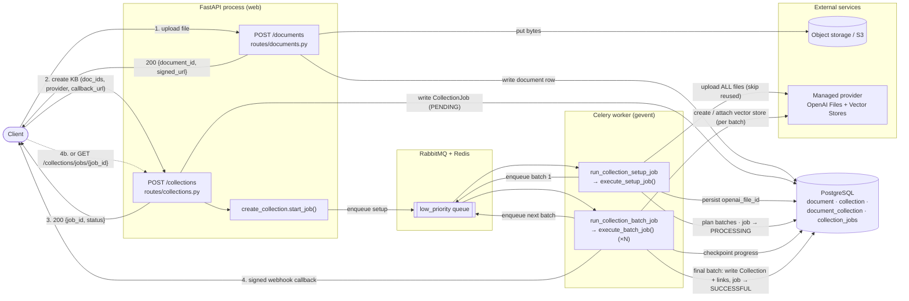
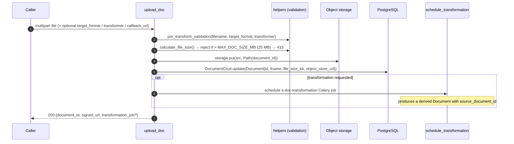
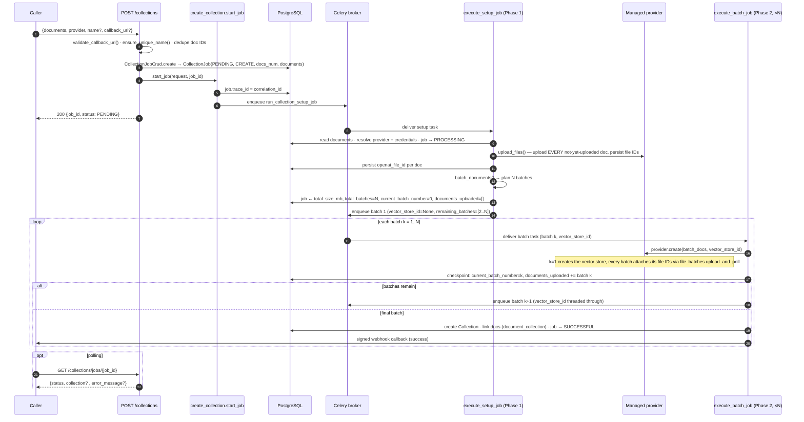
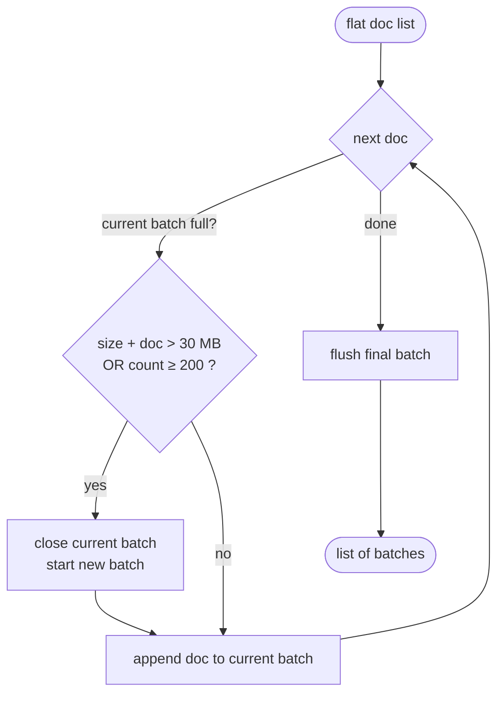
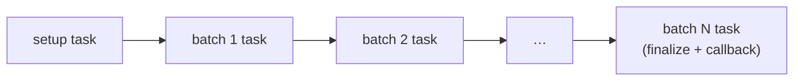
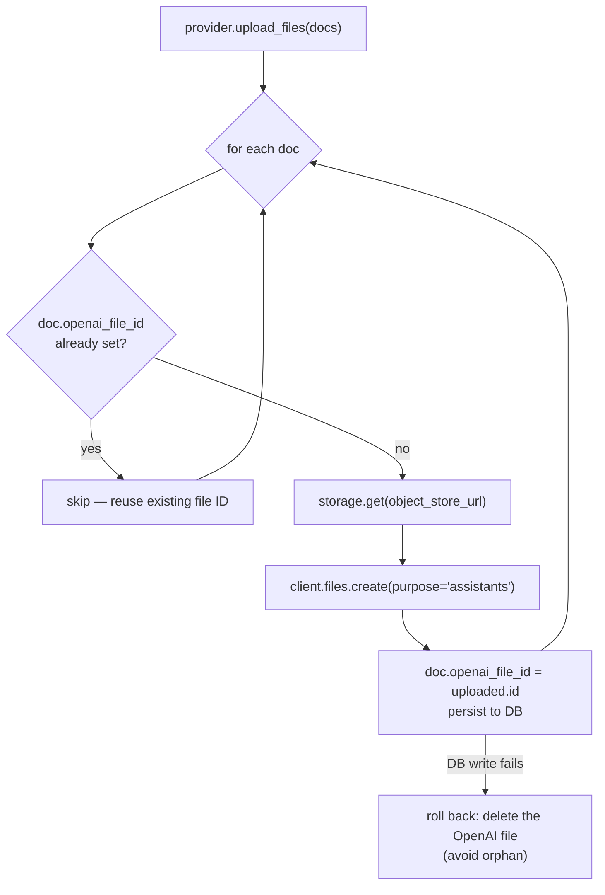
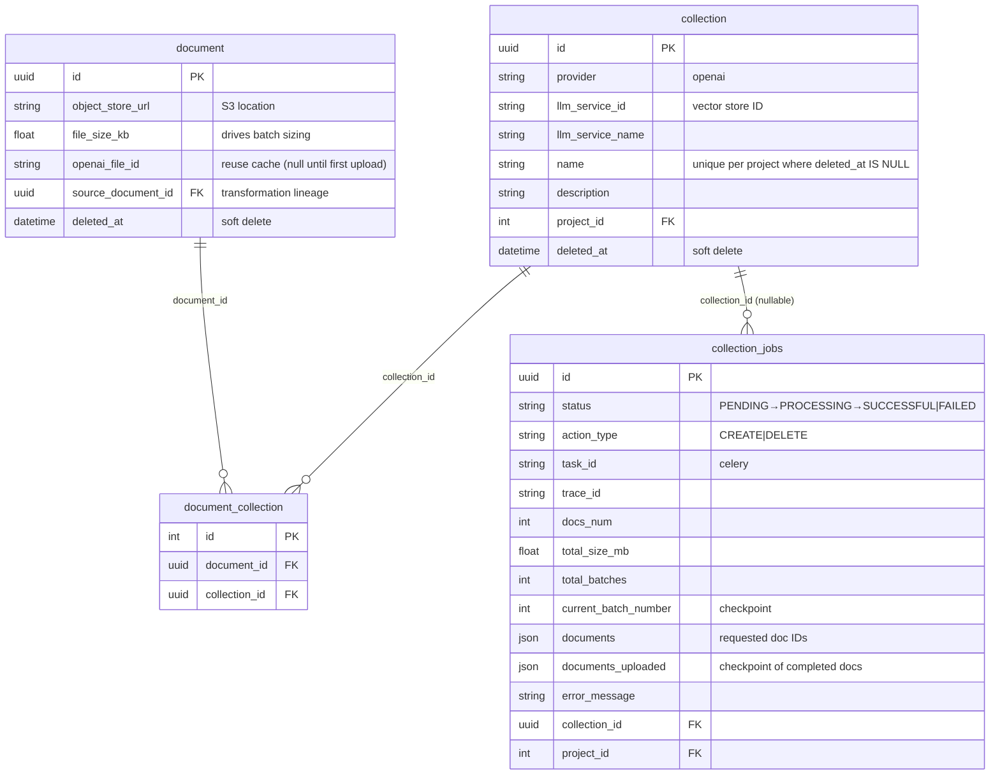
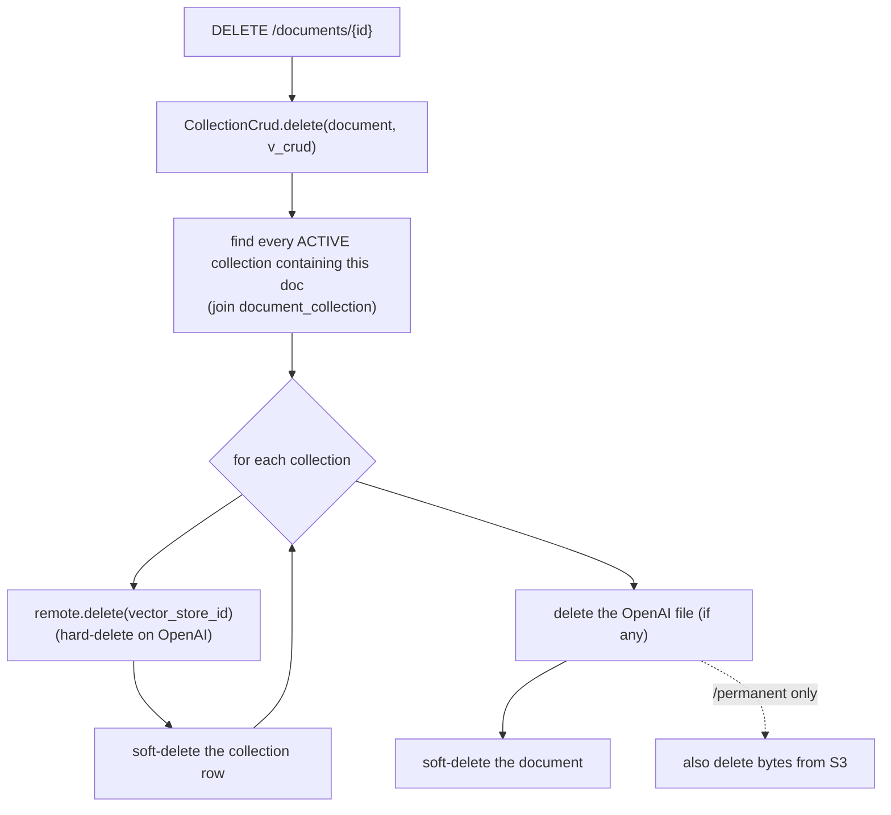

# Kaapi Knowledge Base — Architecture Overview

> Code references in this document point at the `enhancement/collection_batching`
> branch, which carries the current batching implementation. The document itself
> lives on `docs/architecture`.

## Purpose

A **knowledge base** in Kaapi is a *managed vector store* built from a set of
uploaded documents. It is the retrieval substrate behind the File-Search /
RAG pipeline: an `/llm/call` config references a knowledge base by ID
(`knowledge_base_ids`) and the provider does retrieval over it.

Creating one is a two-act story across two endpoints:

1. **`/documents`** — upload raw files. Each upload is stored in object storage
   (S3), recorded as a `document` row, and the caller gets back a document ID.
   This is synchronous and per-file.
2. **`/collections`** — turn a set of document IDs into a vector store on a
   **managed provider** (currently **OpenAI**; Gemini File Search is scaffolded).
   This is **asynchronous, job-based, and batched**: the HTTP call returns a
   `job_id` immediately and a chain of Celery tasks does the work.

Key properties:

- **Async + callback-based** — `POST /collections` returns `200 {job_id, status}`
  immediately; progress is delivered via a signed webhook callback and/or polled
  via `GET /collections/jobs/{job_id}`.
- **Batched** — documents are split into size/count-bounded batches, and **one
  Celery task processes one batch** before queueing the next. This is the central
  design decision (see §6) and exists to dodge worker timeouts on large
  collections (>500 MB or >250 files used to time a single task out).
- **De-duplicated uploads** — the first time a document is pushed to a managed
  provider, the provider's file ID is stored on the `document` row. Subsequent
  collections reuse that file ID instead of re-uploading the bytes (see §7).
- **Immutable** — collections are create-only. There is no "add/remove a document
  from an existing collection" operation, by design (see §10).
- **Multi-tenant** — every row is project-scoped; provider credentials are
  resolved per project.

---

## 1. The 10,000-ft view



The web process does almost nothing for collections: validate, persist a
`CollectionJob` row, enqueue the setup task, return. **All** real work happens on
the worker.

---

## 2. Component map

```
backend/app/
├── api/
│   ├── routes/
│   │   ├── documents.py            POST/GET/DELETE /documents · /documents/{id}/permanent
│   │   ├── collections.py          POST/GET/PATCH/DELETE /collections (+ callback OpenAPI spec)
│   │   └── collection_job.py       GET /collections/jobs/{job_id}  (status polling)
│   └── docs/collections/*.md       Swagger descriptions (load_description)
│
├── services/
│   ├── collections/
│   │   ├── create_collection.py    ★ start_job · execute_setup_job · execute_batch_job
│   │   ├── delete_collection.py    start_job · execute_job  (async collection delete)
│   │   ├── helpers.py              batch_documents · MAX_* constants · extract_error_message
│   │   └── providers/
│   │       ├── base.py             BaseProvider ABC (upload_files · create · delete)
│   │       ├── openai.py           OpenAIProvider  (Files API + Vector Stores)
│   │       └── registry.py         LLMProvider registry · get_llm_provider()
│   └── documents/helpers.py        upload validation · schedule_transformation · schema builders
│
├── celery/
│   ├── tasks/job_execution.py      run_collection_setup_job · run_collection_batch_job ·
│   │                                 run_delete_collection_job  (low_priority, priority=1)
│   └── utils.py                    start_collection_setup_job / _batch_job / _delete_collection_job
│
├── crud/
│   ├── document/document.py        DocumentCrud (read_each · update · soft delete)
│   ├── collection/collection.py    CollectionCrud (create · soft delete · cascade delete)
│   ├── collection/collection_job.py CollectionJobCrud
│   ├── document_collection.py      DocumentCollectionCrud (junction links)
│   └── rag/open_ai.py              OpenAIVectorStoreCrud · OpenAIFileCrud (raw SDK calls)
│
└── models/
    ├── document.py                 Document (table) · DocumentPublic · DocumentUploadResponse
    ├── collection.py               Collection (table) · CreationRequest · DeletionRequest · *Public
    ├── collection_job.py           CollectionJob (table) · CollectionJobStatus · *Public
    └── document_collection.py      DocumentCollection (junction table)
```

`★` = read first. [services/collections/create_collection.py](../../backend/app/services/collections/create_collection.py)
is the spine of knowledge-base creation.

---

## 3. Act I — document upload (`POST /documents`)

[routes/documents.py → `upload_doc`](../../backend/app/api/routes/documents.py)



What lands in the DB ([models/document.py](../../backend/app/models/document.py)):

| Field | Meaning |
|---|---|
| `id` | document UUID (also the object-store key) |
| `object_store_url` | S3 location of the raw bytes |
| `file_size_kb` | used later for batch sizing |
| `openai_file_id` | **null on upload** — filled lazily the first time the doc is pushed to OpenAI (§7) |
| `source_document_id` | set only for transformation outputs (lineage) |
| `deleted_at` | soft-delete marker |

Notes:

- Upload is **synchronous** and **one document per request**. To build a
  knowledge base from many files, the caller uploads each file, collects the
  returned IDs, then calls `/collections` once with the full ID list.
- **Transformations** (e.g. `docx → md`) are a separate subsystem. When
  requested, a transform job runs on Celery and emits a *new* `document` row
  (with `source_document_id` pointing at the original). The knowledge base is
  built from whichever document IDs the caller ultimately passes to
  `/collections`.
- Max **per-document** size is `MAX_DOC_SIZE_MB = 25 MB`
  ([services/collections/helpers.py](../../backend/app/services/collections/helpers.py));
  larger uploads are rejected with `413`.

---

## 4. Act II — collection request anatomy

[models/collection.py](../../backend/app/models/collection.py) — `CreationRequest`:

```jsonc
{
  "documents": ["<uuid>", "<uuid>", ...],   // document IDs to include (deduped)
  "provider": "openai",                      // which managed vector-store provider
  "name": "My KB",                           // optional, unique per project (active)
  "description": "…",                        // optional
  "callback_url": "https://…"                // optional HTTPS webhook (SSRF-validated)
}
```

- `provider` selects the managed vector-store backend. Today only `"openai"` is
  accepted (`ProviderOptions` literal); Gemini / Bedrock are scaffolded but not
  registered.
- `name` is optional but, if given, must be unique among the project's *active*
  (non-deleted) collections — enforced both by `ensure_unique_name()` and a
  partial unique index `uq_collection_project_id_name_active`.
- `documents` is de-duplicated at the route (`dict.fromkeys`) and again in the
  request model.

The immediate response is a `CollectionJobImmediatePublic`:

```jsonc
{ "job_id": "<uuid>", "status": "PENDING", "job_inserted_at": "...", "job_updated_at": "..." }
```

---

## 5. Collection creation lifecycle (sequence)



The job is split into **two phases** that run as **separate Celery tasks** so the
heavy work is chunked:

### Phase 1 — `execute_setup_job` (one task)

[create_collection.py → `execute_setup_job`](../../backend/app/services/collections/create_collection.py)

1. Load the requested `document` rows; resolve the provider + project credentials.
2. Move the job to `PROCESSING`.
3. **Upload all files** to the provider via `provider.upload_files()` — this is
   where the de-dup optimization lives: docs that already carry an
   `openai_file_id` are skipped; new ones are uploaded and their file IDs
   persisted (§7).
4. Compute `total_size_mb` and call `batch_documents()` to produce the batch plan.
5. Persist batch metadata on the job (`total_batches`, `current_batch_number=0`,
   `documents_uploaded=[]`).
6. Enqueue **batch 1** with `vector_store_id=None` and the remaining batches as a
   tail list.

> Note the asymmetry: *file upload to the provider is not itself batched* — it
> happens for all docs in this single setup task. Only the **vector-store attach**
> is batched across Phase-2 tasks. See §11 for the residual timeout risk this
> leaves.

### Phase 2 — `execute_batch_job` (one task per batch, self-chaining)

[create_collection.py → `execute_batch_job`](../../backend/app/services/collections/create_collection.py)

For each batch the task:

1. Resolves the provider and reads this batch's document rows.
2. Calls `provider.create(batch_docs, vector_store_id)`:
   - On batch 1, `vector_store_id is None` → the vector store is **created**, then
     this batch's file IDs are attached.
   - On later batches, the existing `vector_store_id` (threaded through the task
     args) is reused and the batch's file IDs are attached to it.
3. **Checkpoints** progress to the job row (`current_batch_number`,
   `documents_uploaded += this batch`).
4. If batches remain → enqueue the next batch task (passing the resolved
   `vector_store_id` and the shrinking `remaining_batches` tail) and **return**.
5. On the **final** batch → finalize:
   - Create the `Collection` row (`llm_service_id` = vector store ID,
     `llm_service_name`, provider, name, description).
   - Link every uploaded doc to it via `document_collection`.
   - Move the job to `SUCCESSFUL` with `collection_id` set.
   - Send the success callback (if a `callback_url` was given).

The `Collection` row only exists **after the last batch succeeds** — there is no
partially-visible collection mid-run.

---

## 6. Batching strategy (deep dive)

[services/collections/helpers.py → `batch_documents`](../../backend/app/services/collections/helpers.py)



Constants ([helpers.py](../../backend/app/services/collections/helpers.py)):

| Constant | Value | Role |
|---|---|---|
| `MAX_DOC_SIZE_MB` | 25 MB | max size of a single uploaded document (enforced at `/documents`) |
| `MAX_BATCH_SIZE_KB` | 30 MB (`(25+5)·1024`) | a batch closes when adding the next doc would exceed this |
| `MAX_BATCH_COUNT` | 200 | a batch closes when it already holds this many docs |

A new batch starts when **either** bound (size *or* count) would be exceeded by
the next document — whichever comes first.

**Why one task per batch.** Earlier, a single Celery task created the entire
vector store. Large collections (>~500 MB total, or >~250 files) made that task
run long enough to hit the worker's soft time limit
(`CELERY_TASK_SOFT_TIME_LIMIT = 300s`, hard `600s`) and fail. By bounding each
batch to ≤30 MB / ≤200 files and giving each batch its **own** task (which
self-enqueues the next), no single task does enough work to time out. The job's
`documents_uploaded` / `current_batch_number` columns make progress durable
across the task boundaries (added in migration `064_add_batch_tracking_to_collections_jobs`).



---

## 7. De-duplicated uploads (file-ID reuse)

The expensive part of building a vector store is shipping file bytes to the
provider. Kaapi uploads each document's bytes to the provider **once** and
remembers the result.



[providers/openai.py → `upload_files`](../../backend/app/services/collections/providers/openai.py)

- `get_existing_file_id(doc)` returns `doc.openai_file_id`; a non-null value means
  "already uploaded — don't re-send the bytes."
- New uploads persist `openai_file_id` (and a recomputed `file_size_kb`) back to
  the `document` row, so the **next** collection that includes this doc skips the
  upload and just attaches the existing file ID
  (`vector_stores.file_batches.upload_and_poll(files=[], file_ids=[…])`).
- This saves both bandwidth and latency: passing an existing file ID to the
  vector store is far cheaper than re-uploading.
- **Crash-safety:** if the DB write fails after the provider upload succeeds, the
  code deletes the just-uploaded provider file to avoid an orphan, then re-raises.

The attach step itself is in [crud/rag/open_ai.py → `OpenAIVectorStoreCrud.update`](../../backend/app/crud/rag/open_ai.py),
which polls the batch and **raises if any file failed** to attach
(`batch.file_counts.failed > 0`).

---

## 8. Provider abstraction

[providers/base.py](../../backend/app/services/collections/providers/base.py) —
all managed backends implement:

```python
class BaseProvider(ABC):
    def upload_files(self, storage, docs, project_id) -> None: ...   # bytes → provider files (+ persist IDs)
    def create(self, docs, vector_store_id=None) -> Collection: ...  # create/attach vector store for a batch
    def delete(self, collection) -> None: ...                        # tear down remote vector store
    def get_existing_file_id(self, doc) -> str | None: ...           # reuse hook (default None)
```

| Provider | Status | Backed by |
|---|---|---|
| `openai` | ✅ implemented | OpenAI **Files API** + **Vector Stores** ([providers/openai.py](../../backend/app/services/collections/providers/openai.py)) |
| `gemini` (File Search) | 🔜 scaffolded | commented in `registry.py` / `get_service_name` |
| `bedrock` | 🔜 scaffolded | commented |

[providers/registry.py → `get_llm_provider`](../../backend/app/services/collections/providers/registry.py)
resolves the provider class from the `LLMProvider` registry and builds an SDK
client from **per-project credentials** (`get_provider_credential`). Missing or
unsupported credentials raise `ValueError`, which becomes a clean job failure.

`OpenAIProvider.create` returns a lightweight `Collection` carrying only
`llm_service_id` (the vector store ID) and `llm_service_name`; the persisted
`Collection` row is assembled later in the finalize step.

---

## 9. Persistence & state



- **`document`** — one row per uploaded file; bytes live in S3, `openai_file_id`
  is the provider-side reuse cache.
- **`collection`** — one row per knowledge base; `llm_service_id` is the managed
  vector store ID. Soft-deleted via `deleted_at`.
- **`document_collection`** — many-to-many junction; written only at finalize.
- **`collection_jobs`** — the pollable async state machine for both CREATE and
  DELETE, including the batching checkpoint columns.

### Status & result delivery

Two ways to observe a job:

1. **Callback** — `send_callback()` POSTs an `APIResponse` to the `callback_url`
   (HTTPS-only, SSRF-validated, HMAC-signed when a `webhook_secret` is
   configured). Success carries the collection; failure carries the
   error message.
2. **Polling** — [`GET /collections/jobs/{job_id}`](../../backend/app/api/routes/collection_job.py)
   returns the job status; on a successful CREATE it embeds the created
   collection, and on FAILED it surfaces a cleaned `error_message`.

---

## 10. Deletion & immutability

### Async collection delete (`DELETE /collections/{id}`)

[delete_collection.py → `execute_job`](../../backend/app/services/collections/delete_collection.py).
This path mirrors creation: it creates a `CollectionJob(action_type=DELETE)`,
enqueues `run_delete_collection_job`, and returns a `job_id`. The worker
deletes the remote vector store (`provider.delete`), **soft-deletes** the
`collection` row (`deleted_at`), marks the job `SUCCESSFUL`, and fires a callback.
Note that the **provider files are not deleted** here — they remain for reuse by
other collections.

### Synchronous doc delete → cascade (`DELETE /documents/{id}`)

[routes/documents.py → `remove_doc` / `permanent_delete_doc`](../../backend/app/api/routes/documents.py)
takes a very different, **fully synchronous** route:



So deleting **one document** synchronously tears down **every collection that
contains it** — hard-deleting each remote vector store and soft-deleting each
collection row — all inside the request thread, with **no job, no callback, and
no Celery task**.

The cascade is implemented with a `singledispatch` `delete` on
[CollectionCrud](../../backend/app/crud/collection/collection.py): one overload
deletes a `Collection`, the other receives a `Document` and fans out to all of
its active collections.

### Immutability

There is **no** endpoint to add/remove documents from an existing collection.
`PATCH /collections/{id}` edits only `name` / `description`
([routes/collections.py → `update_collection`](../../backend/app/api/routes/collections.py)).
To change membership you create a **new** collection. The rationale is
**evaluation reproducibility** — see §11.

---

## 11. Known limitations, sharp edges & TODOs

This section captures intentional-but-rough behaviour and open design questions.
Treat it as the "read me before you touch this" list.

### 11.1 Document deletion is synchronous and cascades — should be a job

- `DELETE /documents/{id}` deletes the document **and every collection that
  contains it**, synchronously, in the web request thread. For a doc that is part
  of several / large collections this blocks the request on multiple remote
  vector-store deletions and DB writes — a latency and availability risk for the
  backend.
- **TODO:** move the cascade into a Celery task (mirroring the async collection
  delete), or at minimum bound/parallelize it.

### 11.2 Should deleting a doc delete its collections at all?

- The cascade is aggressive: removing one source document silently destroys whole
  knowledge bases that may still be referenced by production configs. It also
  bypasses the job/callback machinery that the dedicated collection-delete
  endpoint uses, so callers get no async notification.
- This is entangled with the immutability decision (§11.3): because a collection
  cannot have a member removed, the only way to "remove a doc from a KB" became
  "delete the KB" — which is almost certainly not what a caller deleting a single
  document expects.
- **TODO:** rethink the contract. Options: block deletion of docs that are in
  active collections; detach instead of cascade-delete; or make the behaviour
  explicit and opt-in. Whatever is chosen must be **communicated clearly to
  users.**

### 11.3 Collections are immutable — the evals rationale

- Collections are create-only on purpose. Kaapi has **evals** wired into configs:
  a caller runs evals against a specific config (which pins a `collection_id`),
  validates it, and ships it to production.
- If a collection were mutable, mutating its documents would change retrieval
  behaviour **without** changing the `collection_id` or vector store ID the config
  points at. The config would silently drift from the version that was eval'd —
  the evals would need to be re-run, but nothing signals that.
- Immutability keeps a `collection_id` a stable, reproducible artifact. The
  doc-delete cascade (§11.2) is the awkward consequence of this rule meeting the
  "I just want to remove a file" use case.
- **TODO / options:** versioned collections (new version = new ID, old one frozen),
  or explicit "fork to edit" semantics — anything that lets membership evolve
  without breaking eval reproducibility. Until then, **document the immutability
  contract for users.**

### 11.4 Partial-batch failure can orphan a vector store

When a batch fails **after** earlier batches created and populated the vector
store, the remote vector store can be left orphaned:

- The whole job fails: the failing `execute_batch_job` marks the job `FAILED` and
  sends a failure callback. No `Collection` row is created (it only appears on the
  final batch), and no further batches are queued.
- Cleanup is guarded by `if provider is not None and result is not None:
  provider.delete(result)` in `_handle_job_failure`. But `result` is only set
  **after** `provider.create()` returns. If `provider.create()` itself raises
  (the common failure — e.g. an attach/parse error), `result` stays `None`, so
  the **cleanup is skipped** and the vector store built by previous batches is
  left dangling on the provider.
- Uploaded provider **files persist** regardless (their IDs are saved on the
  `document` rows) — this is intentional for reuse, not a leak.
- **TODO:** track the resolved `vector_store_id` independently of `result` so a
  mid-chain failure can always tear down the in-progress vector store.

### 11.5 File upload to the provider is not batched

- Batching protects the **vector-store attach** step, but `execute_setup_job`
  uploads **all** new files to the provider in a single task before batching
  begins. For a collection with many large *new* (not-yet-uploaded) documents,
  that one setup task can still approach the soft time limit.
- The reuse optimization (§7) mitigates this for repeat documents, but a
  first-time bulk upload is still a single-task operation.
- **TODO:** consider batching the upload phase too, or moving uploads into the
  per-batch tasks.

### 11.6 Two divergent delete paths

- `DELETE /collections/{id}` is async, job-tracked, and callback-driven and
  **soft-deletes**.
- `DELETE /documents/{id}` cascade is synchronous, untracked, and callback-less,
  yet **hard-deletes the remote vector store**.
- The inconsistency makes behaviour hard to reason about. **TODO:** converge on
  one mechanism.

---

## 12. Execution semantics & failure modes

| Concern | Behaviour |
|---|---|
| **Async** | `POST /collections` returns `job_id` immediately; work runs on the Celery `low_priority` (priority 1) queue. |
| **Batching** | One task per batch (≤30 MB / ≤200 docs), self-chaining; progress checkpointed to the job row across tasks. |
| **Timeout** | `SoftTimeLimitExceeded` / gevent `Timeout` → job `FAILED` ("Task exceeded soft time limit") + failure callback, then re-raised. |
| **Provider / attach error** | `OpenAIVectorStoreCrud.update` raises if any file fails to attach → job `FAILED`; see §11.4 for the orphan-cleanup gap. |
| **Upload then DB failure** | The just-uploaded provider file is deleted to avoid an orphan; the job fails. |
| **Credentials missing** | `get_llm_provider` raises `ValueError` → clean job failure. |
| **Callback delivery** | Best-effort; HTTPS-only, SSRF-validated, optional HMAC signing. A failed callback does not change job status (still pollable). |
| **Idempotency** | The `Collection` row is created only on final-batch success, so a failed run leaves no half-built collection in the DB (remote vector store may still need cleanup — §11.4). |

---

## 13. Where to start reading

1. [api/routes/documents.py](../../backend/app/api/routes/documents.py) — upload + (synchronous) delete surface.
2. [api/routes/collections.py](../../backend/app/api/routes/collections.py) — the thin create/list/get/patch/delete surface + callback spec.
3. [services/collections/create_collection.py](../../backend/app/services/collections/create_collection.py) — **`execute_setup_job` → `execute_batch_job`** (the batched pipeline).
4. [services/collections/helpers.py](../../backend/app/services/collections/helpers.py) — `batch_documents` + the size/count constants.
5. [services/collections/providers/openai.py](../../backend/app/services/collections/providers/openai.py) + [providers/base.py](../../backend/app/services/collections/providers/base.py) — the provider contract and reuse logic.
6. [services/collections/delete_collection.py](../../backend/app/services/collections/delete_collection.py) — async deletion (contrast with the synchronous doc cascade in `routes/documents.py`).

---

## Related

- `kaapi-llm-call-ARCHITECTURE.md` — `POST /llm/call`, the consumer of knowledge
  bases. A config's `knowledge_base_ids` reference the `collection.llm_service_id`
  built here; the provider does File-Search/RAG retrieval over that vector store.
