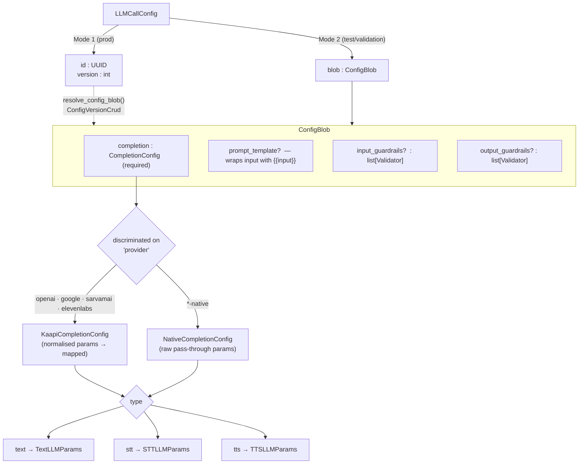
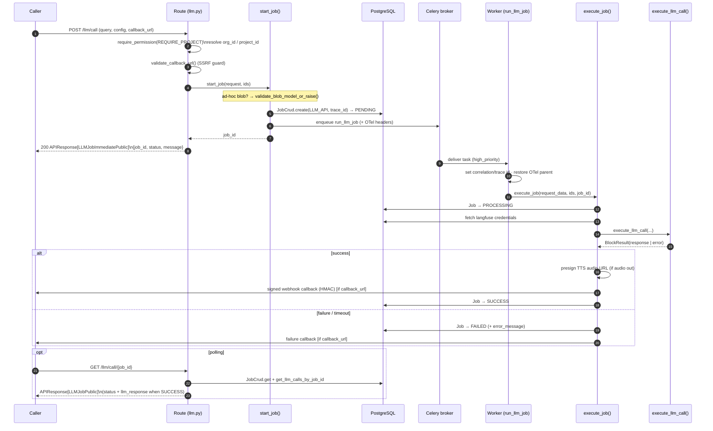
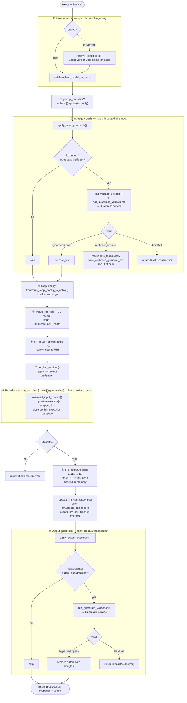
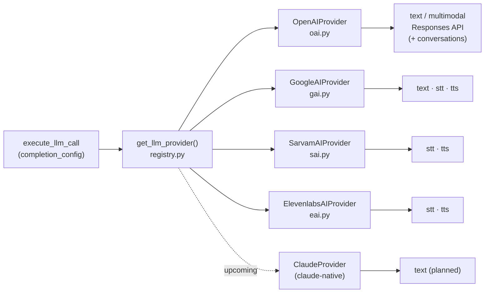
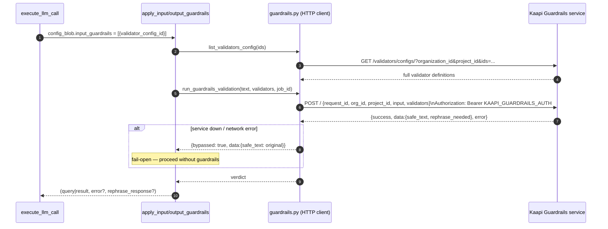
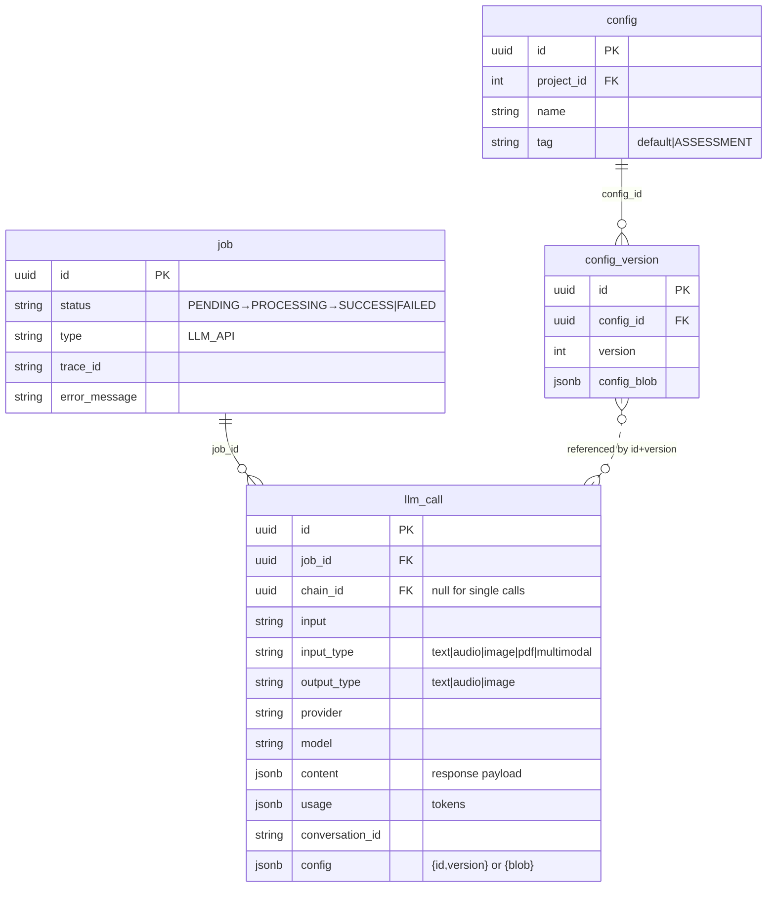
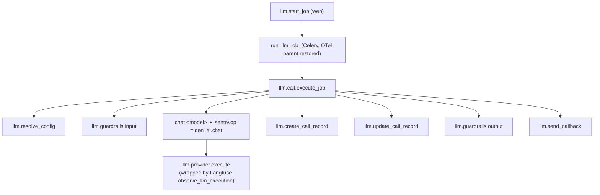

# Kaapi `/llm/call` — Architecture Overview

## Purpose

`POST /llm/call` is the **baseline primitive** of the Kaapi platform: a single, provider-agnostic, multimodal LLM invocation endpoint. A caller submits a `query` (the user input) plus a `config` (what to do with it), and Kaapi runs the whole pipeline — input guardrails → provider call → output guardrails → persistence → callback — asynchronously on a Celery worker.

It is:

- **Multimodal** — text, image, PDF, and audio in; text or audio out. Three completion *modes*: `text` (chat / vision / document understanding), `stt` (speech‑to‑text), `tts` (text‑to‑speech).
- **Multi‑provider** — OpenAI and Google (Gemini) for text; Google, SarvamAI, ElevenLabs for STT/TTS. Anthropic/Claude is scaffolded for text (upcoming). Each provider can be addressed either through the **Kaapi abstraction** (normalised params) or in **native pass‑through** mode.
- **Config‑driven** — everything that happens inside a call is dictated by a `ConfigBlob`: the `completion` config (mode + provider + params), an optional `prompt_template`, and `input_guardrails` / `output_guardrails`. The config can be supplied inline (ad‑hoc blob) or referenced by `id + version` from the versioned config store.
- **Async + callback‑based** — the HTTP request only *registers* the job and returns a `job_id`. Work runs on a background worker; the result is delivered via a signed webhook callback and/or polled via `GET /llm/call/{job_id}`.
- **Observable** — OpenTelemetry spans (Sentry AI Insights), Langfuse generations, Prometheus‑style metrics, and two DB audit trails (`job`, `llm_call`).

> Guardrails are **not** executed in this repo. They are delegated over HTTP to the **Kaapi Guardrails** sister microservice (see `kaapi-guardrails-ARCHITECTURE.md`). This repo only *references* validator configs by UUID and POSTs text to that service.

---

## 1. The 10,000‑ft view

```mermaid
flowchart LR
    Caller([Client / Chatbot])

    subgraph API["FastAPI process (web)"]
        Route["POST /llm/call\nroutes/llm.py"]
        StartJob["start_job()\nservices/llm/jobs.py"]
    end

    subgraph Broker["RabbitMQ + Redis"]
        Q[["high_priority queue"]]
    end

    subgraph Worker["Celery worker (gevent)"]
        Task["run_llm_job\ntasks/job_execution.py"]
        ExecJob["execute_job()"]
        ExecCall["execute_llm_call()\n— the pipeline —"]
    end

    subgraph External["External services"]
        Guard["Kaapi Guardrails service\n(sister repo)"]
        Prov["LLM providers\nOpenAI · Gemini · Sarvam · ElevenLabs"]
        S3[("Object storage / S3")]
        LF["Langfuse"]
    end

    DB[("PostgreSQL\njob · llm_call · config")]

    Caller -- "1. request" --> Route
    Route --> StartJob
    StartJob -- "2. write Job (PENDING)" --> DB
    StartJob -- "3. enqueue" --> Q
    Route -- "4. 200 {job_id}" --> Caller

    Q --> Task --> ExecJob --> ExecCall
    ExecCall <--> Guard
    ExecCall <--> Prov
    ExecCall <--> S3
    ExecCall -. traces .-> LF
    ExecCall -- "write llm_call + Job(SUCCESS)" --> DB
    ExecJob -- "5. signed webhook callback" --> Caller
    Caller -. "5b. or GET /llm/call/{job_id}" .-> Route
```



The web process does almost nothing: validate, persist a `Job` row, enqueue, and return. **All** real work happens on the worker inside `execute_llm_call()`.

---

## 2. Component map

```
backend/app/
├── api/
│   ├── routes/llm.py              POST /llm/call · GET /llm/call/{job_id} · callback OpenAPI spec
│   └── docs/llm/llm_call.md       Swagger description (loaded via load_description)
│
├── services/llm/
│   ├── jobs.py                    ★ start_job · execute_job · execute_llm_call
│   │                                + apply_input_guardrails / apply_output_guardrails
│   ├── guardrails.py              HTTP client to the Guardrails microservice
│   ├── mappers.py                 Kaapi params → native provider params (+ warnings)
│   └── providers/
│       ├── base.py                BaseProvider ABC · MultiModalInput
│       ├── registry.py            LLMProvider registry · get_llm_provider()
│       ├── oai.py                 OpenAIProvider   (text + multimodal, Responses API)
│       ├── gai.py                 GoogleAIProvider (text · stt · tts)
│       ├── sai.py                 SarvamAIProvider (stt · tts)
│       └── eai.py                 ElevenlabsAIProvider (stt · tts)
│
├── celery/
│   ├── tasks/job_execution.py     run_llm_job (high_priority, priority=9, soft timeout)
│   └── utils.py                   start_llm_job() — enqueue with OTel trace headers
│
├── models/
│   ├── llm/request.py             LLMCallRequest · QueryParams · ConfigBlob · CompletionConfig · LlmCall (table)
│   ├── llm/response.py            LLMCallResponse · LLMResponse · Usage · LLMJob*Public
│   ├── config/config.py           Config (table) — named, project‑scoped
│   └── config/version.py          ConfigVersion (table) — immutable JSONB config_blob per version
│
├── crud/
│   ├── llm.py                     create_llm_call · update_llm_call_response · save_rephrase_guardrail_call
│   ├── jobs.py                    JobCrud (create / get / update status)
│   ├── config.py                  ConfigVersionCrud (resolve stored config)
│   └── model_config.py            validate_blob_model_or_raise · is_reasoning_model (DB = source of truth)
│
└── core/
    ├── langfuse/langfuse.py       observe_llm_execution decorator
    ├── telemetry.py               OTel spans, gen_ai metrics, log_context
    └── cloud/storage.py           S3 upload + presigned URLs (STT/TTS audio)
```

`★` = the file to read first. [services/llm/jobs.py](../../backend/app/services/llm/jobs.py) is the spine of the whole feature.

---

## 3. Request & config anatomy

### 3.1 `LLMCallRequest`

Defined in [models/llm/request.py](../../backend/app/models/llm/request.py).

```jsonc
{
  "query": {                          // QueryParams — the dynamic, per-request input
    "input": "...",                   // string | structured input | list (multimodal)
    "conversation": {                 // optional, for stateful chat
      "id": "conv_abc",               //   continue existing conversation, OR
      "auto_create": true             //   create a new one (mutually exclusive with id)
    }
  },
  "config": { ... },                  // LLMCallConfig — see 3.3
  "callback_url": "https://...",      // optional HTTPS webhook (SSRF-validated)
  "include_provider_raw_response": false,
  "request_metadata": { "any": "..." } // echoed back untouched in the response
}
```

`QueryParams.normalize_input` rewrites a bare string into a `TextInput` so downstream code always sees a structured input.

### 3.2 Input types (discriminated on `type`)

| `query.input` form | Resolves to (`resolve_input` in [utils.py](../../backend/app/utils.py)) | Used by modes |
|---|---|---|
| `"hello"` / `TextInput` | plain `str` | text, tts |
| `AudioInput` (base64 or url) | temp **file path** (downloaded/decoded) | stt |
| `ImageInput` (single or list) | `list[ImageContent]` | text (vision) |
| `PDFInput` (single or list) | `list[PDFContent]` | text (doc understanding) |
| `list[QueryInput]` (text+image+pdf) | `MultiModalInput(parts=[...])` | text |

> Audio is only valid as a *single* `AudioInput` and only for `stt`. It cannot be mixed into a multimodal list.

### 3.3 `config` — stored reference *or* inline blob

`LLMCallConfig` enforces XOR: either `id + version` (stored) **or** `blob` (ad‑hoc), never both.



- **`completion`** decides *mode* (`type`: text/stt/tts) and *provider*. This is the single field that routes the entire execution flow.
- **`Validator`** in a guardrails list is just `{ "validator_config_id": "<uuid>" }` — a pointer into the Guardrails service's saved validator presets. The actual validator definition lives in the sister service.
- **Stored configs** are versioned: `Config` (named, project‑scoped) → many `ConfigVersion` (immutable JSONB `config_blob`). Production callers pin `id + version` for reproducibility.

### 3.4 Kaapi abstraction vs. native pass‑through

- **Kaapi** (`provider: "openai"`): caller sends normalised params (`model`, `instructions`, `temperature`, `reasoning`, `knowledge_base_ids`, …). At execution time `transform_kaapi_config_to_native()` ([mappers.py](../../backend/app/services/llm/mappers.py)) maps them to each provider's native shape and emits **warnings** for anything suppressed (e.g. `temperature` on a reasoning model, `knowledge_base_ids` on Gemini). Warnings ride back in `response.metadata.warnings`.
- **Native** (`provider: "openai-native"`): `params` are forwarded verbatim to the provider SDK. No mapping, no model‑allowlist check.

**Model allow‑listing:** for Kaapi configs, `validate_blob_model_or_raise()` ([crud/model_config.py](../../backend/app/crud/model_config.py)) checks the `model` (and TTS `voice`) against the DB‑driven `model_config` table — the source of truth — and 400s on unknown/unsupported combos. Native configs are exempt.

---

## 4. Request lifecycle (sequence)



**Two ways to get the result:**
1. **Callback** — `send_callback()` POSTs the `APIResponse` to `callback_url`. HTTPS‑only, SSRF‑hardened (blocks private IPs / loopback / cloud metadata, no redirects), optionally **HMAC‑SHA256 signed** (`X-Webhook-Signature` + `X-Webhook-Timestamp`) when a `webhook_secret` credential is configured.
2. **Polling** — `GET /llm/call/{job_id}` returns job status; on `SUCCESS` it reads the `llm_call` row, and for audio output swaps the stored `s3://` path for a short‑lived presigned URL.

---

## 5. The pipeline: `execute_llm_call()`

This is the core. Everything below happens inside one function in [services/llm/jobs.py](../../backend/app/services/llm/jobs.py), each step wrapped in its own OTel span.



Notes on the branches:

- **Guardrails are fail‑open.** If the Guardrails service is unreachable, `run_guardrails_validation()` returns `{bypassed: true}` and the pipeline proceeds *without* guardrails rather than failing the call.
- **Guardrails only apply to text.** Non‑text input (audio/image/pdf) skips input guardrails; non‑text output (audio) skips output guardrails.
- **`rephrase_needed` short‑circuits the LLM.** When an input guardrail asks the user to rephrase, the safe text is returned directly (zero tokens), persisted via `save_rephrase_guardrail_call`, and no provider call is made.
- **Errors become `BlockResult(error=...)`**, which `execute_job` turns into a failure `APIResponse` + `Job → FAILED` + (optional) failure callback.

---

## 6. Provider routing

Once `completion.provider` (always native by this point) and `completion.type` are known, the call fans out:



### 6.1 Capability matrix

| Provider (key) | text | stt | tts | Notes |
|---|:--:|:--:|:--:|---|
| `openai` / `openai-native` | ✅ | — | — | Responses API; vision + PDF via `format_parts`; conversation `id` / `auto_create`. |
| `google` / `google-native` | ✅ | ✅ | ✅ | Gemini. TTS outputs 24 kHz PCM → wrapped to WAV, optionally transcoded to MP3/OGG. STT uploads the audio file then prompts for transcription/translation. |
| `sarvamai` / `sarvamai-native` | — | ✅ | ✅ | Indian‑language STT (`saaras`/`saarika`) + TTS (`bulbul`). |
| `elevenlabs` / `elevenlabs-native` | — | ✅ | ✅ | Voice‑id + language mapping via mappers. |
| `claude-native` | 🔜 | — | — | Scaffolded in the registry, not yet wired. |

### 6.2 The provider contract

All providers extend `BaseProvider` ([providers/base.py](../../backend/app/services/llm/providers/base.py)):

```python
class BaseProvider(ABC):
    @staticmethod
    @abstractmethod
    def create_client(credentials: dict) -> Any: ...

    @abstractmethod
    def execute(
        self,
        completion_config: NativeCompletionConfig,
        query: QueryParams,
        resolved_input: str | list[ContentPart] | MultiModalInput,
        include_provider_raw_response: bool = False,
    ) -> tuple[LLMCallResponse | None, str | None]:  # (response, error)
        ...
```

- Providers always return a **normalised** `LLMCallResponse` (`LLMResponse` + `Usage`) or an error string — never raise into the pipeline.
- `get_llm_provider()` resolves per‑project credentials (stripping the `-native` suffix to find the credential, e.g. `openai-native` → `openai`) and builds the SDK client. Missing credentials → `ValueError` → clean `BlockResult(error)`.
- Multi‑modal `text` providers (`OpenAIProvider`, `GoogleAIProvider`) implement a `format_parts()` to translate `MultiModalInput` parts into each SDK's content shape; STT/TTS providers take a file path or text string.

---

## 7. Guardrails integration (to the sister service)

This repo never runs validators itself. [services/llm/guardrails.py](../../backend/app/services/llm/guardrails.py) is a thin HTTP client to the **Kaapi Guardrails** microservice.



Two endpoints on the sister service are consumed:

| Call | Endpoint | Purpose |
|---|---|---|
| `list_validators_config()` | `GET {KAAPI_GUARDRAILS_URL}/validators/configs/` | Resolve `validator_config_id` UUIDs into full validator definitions (org/project scoped). |
| `run_guardrails_validation()` | `POST {KAAPI_GUARDRAILS_URL}/` | Submit text + validators; receive `safe_text` / `rephrase_needed` / error. `request_id` = the Kaapi `job_id`. |

Verdict handling (in `apply_input_guardrails` / `apply_output_guardrails`):

| Guardrails result | Input guardrail effect | Output guardrail effect |
|---|---|---|
| `success`, `rephrase_needed=false` | replace input with `safe_text`, continue | replace output with `safe_text`, return |
| `success`, `rephrase_needed=true` | **short‑circuit**: return `safe_text` to user, no LLM call | (n/a) |
| `success=false` (hard fail) | `BlockResult(error)` → job FAILED | `BlockResult(error)` → job FAILED |
| `bypassed=true` (service down) | continue without guardrails | continue without guardrails |

Settings: `KAAPI_GUARDRAILS_URL`, `KAAPI_GUARDRAILS_AUTH` in [core/config.py](../../backend/app/core/config.py).

---

## 8. Persistence & state



- **`job`** — one row per `/llm/call`, the pollable status machine (`PENDING → PROCESSING → SUCCESS | FAILED`).
- **`llm_call`** — one row per provider invocation, the audit record (input, provider/model, content, token usage, resolved config, conversation id). A rephrase short‑circuit also writes an `llm_call` row.
- **`config` + `config_version`** — the versioned config store backing Mode‑1 (`id + version`) requests.
- **Audio handling:** STT input and TTS output are uploaded to **S3** (`orgs/{org}/{project}/audio/{stt|tts}`); the DB stores only the `s3://` URI (not the base64), and presigned URLs are minted on read (callback / polling). The in‑memory response keeps base64 for backward compatibility.

---

## 9. Observability

Three layers, all keyed off the same `trace_id` (the request `correlation_id`, propagated to Celery via injected OTel headers):



| Layer | What it captures | Where |
|---|---|---|
| **OpenTelemetry / Sentry** | Span tree above. The `chat <model>` span carries `sentry.op = gen_ai.chat` so Sentry **AI Insights** surfaces model, tokens, and latency. | [core/telemetry.py](../../backend/app/core/telemetry.py) |
| **Langfuse** | LLM generations/traces around the actual provider call; `session_id` = `conversation_id` for stateful chats. Enabled per‑project via stored `langfuse` credentials. | [core/langfuse/langfuse.py](../../backend/app/core/langfuse/langfuse.py) |
| **Metrics** | `record_llm_call_started` / `record_llm_call_finished` (provider, model, duration, token counts, error flag). | [core/telemetry.py](../../backend/app/core/telemetry.py) |
| **DB audit** | `job` + `llm_call` rows (see §8). | [crud/llm.py](../../backend/app/crud/llm.py), [crud/jobs.py](../../backend/app/crud/jobs.py) |

`flush_telemetry()` is called in a `finally` so spans/metrics ship even on failure.

---

## 10. Execution semantics & failure modes

| Concern | Behaviour |
|---|---|
| **Async** | The endpoint returns `job_id` immediately; the LLM call runs on a Celery `high_priority` (priority 9) task with a gevent soft time limit (`CELERY_TASK_SOFT_TIME_LIMIT`). |
| **Timeout** | `SoftTimeLimitExceeded` / gevent `Timeout` → job FAILED with "Task exceeded soft time limit" + failure callback, then re‑raised. |
| **Provider error** | Normalised to an error string in `BlockResult` → failure `APIResponse` → job FAILED. Provider exceptions never crash the worker. |
| **Guardrails down** | Fail‑open (bypassed) — the call proceeds without guardrails. |
| **Credentials missing** | `get_llm_provider` raises `ValueError` → clean `BlockResult(error)`. |
| **Callback delivery** | Best‑effort; SSRF‑validated, HTTPS‑only, optional HMAC signing. A failed callback does not change the job status (result is still pollable). |
| **Idempotency / retries** | One Celery task per job; status transitions are recorded so a poller always sees a definitive terminal state. |

---

## 11. Where to start reading

1. [api/routes/llm.py](../../backend/app/api/routes/llm.py) — the thin HTTP surface (and the callback OpenAPI spec).
2. [services/llm/jobs.py](../../backend/app/services/llm/jobs.py) — `start_job` → `execute_job` → **`execute_llm_call`** (the pipeline).
3. [models/llm/request.py](../../backend/app/models/llm/request.py) — `LLMCallRequest`, `ConfigBlob`, the completion‑config union.
4. [services/llm/providers/](../../backend/app/services/llm/providers/) — `base.py` + `registry.py`, then a concrete provider (`oai.py` for text, `gai.py` for the full text/stt/tts span).
5. [services/llm/mappers.py](../../backend/app/services/llm/mappers.py) — Kaapi → native parameter mapping + warnings.
6. [services/llm/guardrails.py](../../backend/app/services/llm/guardrails.py) + `kaapi-guardrails-ARCHITECTURE.md` — the delegated guardrails.

---

## Related

- `kaapi-guardrails-ARCHITECTURE.md` — the sister microservice this endpoint delegates all validation to.
- **LLM chains** — `POST /llm/chain` (`start_chain_job` / `execute_chain_job` in the same `jobs.py`) reuse `execute_llm_call` per block, threading each block's output into the next block's input. The single `/llm/call` is one un‑chained block.
